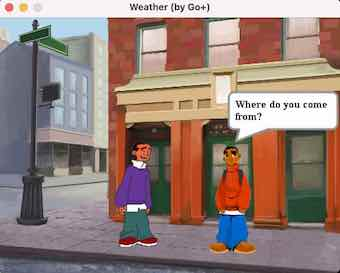
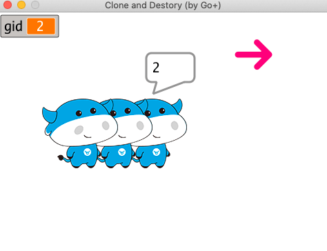

spx - A Scratch Compatible 2D Game Engine
========

[](https://github.com/goplus/spx/actions/workflows/go.yml)
[](https://goreportcard.com/report/github.com/goplus/spx)
[](https://github.com/goplus/spx/releases)
[](https://github.com/goplus/gop)
[](https://github.com/xushiwei/goplus-spx-vs-scratch/blob/main/scratch-vs-spx-v1.0.0-beta3.pdf)

## How to build

How to run games powered by Go+ spx engine?

* Install go (version == 1.21.3)
* Install python (version >= 3.8)
* Install make
* Install [`mingw-w64`](https://www.mingw-w64.org/) (Windows only)
* Add the Go environment's bin directory to the system PATH.
```
    export PATH=$PATH:$GOPATH/bin
```
* Download Go+ and build it. See https://github.com/goplus/gop#how-to-build.
* Download spx and build it.
	```sh
	# please use Git Bash to run the following commands in windows platform
	git clone https://github.com/goplus/spx.git
	cd spx
	git checkout dev
	make init

	# run the demo
	spx run -path tutorial/00-Hello
	```
* Build a game and run.
  * cd `game-root-dir`
  * gop run .


## Games powered by spx

* [AircraftWar](https://github.com/goplus/AircraftWar)
* [FlappyCalf](https://github.com/goplus/FlappyCalf)
* [MazePlay](https://github.com/goplus/MazePlay)
* [BetaGo](https://github.com/xushiwei/BetaGo)
* [Gobang](https://github.com/xushiwei/Gobang)
* [Dinosaur](https://github.com/xushiwei/Dinosaur)


## Tutorials

### tutorial/01-Weather

 

Through this example you can learn how to listen events and do somethings.

Here are some codes in [Kai.spx](tutorial/01-Weather/Kai.spx):

```coffee
onStart => {
	say "Where do you come from?", 2
	broadcast "1"
}

onMsg "2", => {
	say "What's the climate like in your country?", 3
	broadcast "3"
}

onMsg "4", => {
	say "Which seasons do you like best?", 3
	broadcast "5"
}
```

We call `onStart` and `onMsg` to listen events. `onStart` is called when the program is started. And `onMsg` is called when someone calls `broadcast` to broadcast a message.

When the program starts, Kai says `Where do you come from?`, and then broadcasts the message `1`. Who will recieve this message? Let's see codes in [Jaime.spx](tutorial/01-Weather/Jaime.spx):

```coffee
onMsg "1", => {
	say "I come from England.", 2
	broadcast "2"
}

onMsg "3", => {
	say "It's mild, but it's not always pleasant.", 4
	# ...
	broadcast "4"
}
```

Yes, Jaime recieves the message `1` and says `I come from England.`. Then he broadcasts the message `2`. Kai recieves it and says `What's the climate like in your country?`.

The following procedures are very similar. In this way you can implement dialogues between multiple actors.

### tutorial/02-Dragon


Through this example you can learn how to define variables and show them on the stage.

Here are all the codes of [Dragon](tutorial/02-Dragon/Dragon.spx):

```coffee
var (
	score int
)

onStart => {
	score = 0
	for {
		turn rand(-30, 30)
		step 5
		if touching("Shark") {
			score++
			play chomp, true
			step -100
		}
	}
}
```

We define a variable named `score` for `Dragon`. After the program starts, it moves randomly. And every time it touches `Shark`, it gains one score.

How to show the `score` on the stage? You don't need write code, just add a `stageMonitor` object into [assets/index.json](tutorial/02-Dragon/assets/index.json):

```json
{
  "zorder": [
    {
      "type": "monitor",
      "name": "dragon",
      "size": 1,
      "target": "Dragon",
      "val": "getVar:score",
      "color": 15629590,
      "label": "score",
      "mode": 1,
      "x": 5,
      "y": 5,
      "visible": true
    }
  ]
}
```

### tutorial/03-Clone



Through this example you can learn:
* Clone sprites and destory them.
* Distinguish between sprite variables and shared variables that can access by all sprites.

Here are some codes in [Calf.spx](tutorial/03-Clone/Calf.spx):

```coffee
var (
	id int
)

onClick => {
	clone
}

onCloned => {
	gid++
	...
}
```

When we click the sprite `Calf`, it receives an `onClick` event. Then it calls `clone` to clone itself. And after cloning, the new `Calf` sprite will receive an `onCloned` event.

In `onCloned` event, the new `Calf` sprite uses a variable named `gid`. It doesn't define in [Calf.spx](tutorial/03-Clone/Calf.spx), but in [main.spx](tutorial/03-Clone/main.spx).


Here are all the codes of [main.spx](tutorial/03-Clone/main.spx):

```coffee
var (
	Arrow Arrow
	Calf  Calf
	gid   int
)

run "res", {Title: "Clone and Destory (by Go+)"}
```

All these three variables in [main.spx](tutorial/03-Clone/main.spx) are shared by all sprites. `Arrow` and `Calf` are sprites that exist in this project. `gid` means `global id`. It is used to allocate id for all cloned `Calf` sprites.

Let's back to [Calf.spx](tutorial/03-Clone/Calf.spx) to see the full codes of `onCloned`:

```coffee
onCloned => {
	gid++
	id = gid
	step 50
	say id, 0.5
}
```

It increases `gid` value and assigns it to sprite `id`. This makes all these `Calf` sprites have different `id`. Then the cloned `Calf` moves forward 50 steps and says `id` of itself.

Why these `Calf` sprites need different `id`? Because we want destory one of them by its `id`.

Here are all the codes in [Arrow.spx](tutorial/03-Clone/Arrow.spx):

```coffee
onClick => {
	broadcast "undo", true
	gid--
}
```

When we click `Arrow`, it broadcasts an "undo" message (NOTE: We pass the second parameter `true` to broadcast to indicate we wait all sprites to finish processing this message).

All `Calf` sprites receive this message, but only the last cloned sprite finds its `id` is equal to `gid` then destroys itself. Here are the related codes in [Calf.spx](tutorial/03-Clone/Calf.spx):

```coffee
onMsg "undo", => {
	if id == gid {
		destroy
	}
}
```

### tutorial/04-Bullet


Through this example you can learn:
* How to keep a sprite following mouse position.
* How to fire bullets.

It's simple to keep a sprite following mouse position. Here are some related codes in [MyAircraft.spx](tutorial/04-Bullet/MyAircraft.spx):


```coffee
onStart => {
	for {
		# ...
		setXYpos mouseX, mouseY
	}
}
```

Yes, we just need to call `setXYpos mouseX, mouseY` to follow mouse position.

But how to fire bullets? Let's see all codes of [MyAircraft.spx](tutorial/04-Bullet/MyAircraft.spx):

```coffee
onStart => {
	for {
		wait 0.1
		Bullet.clone
		setXYpos mouseX, mouseY
	}
}
```

In this example, `MyAircraft` fires bullets every 0.1 seconds. It just calls `Bullet.clone` to create a new bullet. All the rest things are the responsibility of `Bullet`.

Here are all the codes in [Bullet.spx](tutorial/04-Bullet/Bullet.spx):

```coffee
onCloned => {
	setXYpos MyAircraft.xpos, MyAircraft.ypos+5
	show
	for {
		wait 0.04
		changeYpos 10
		if touching(Edge) {
			destroy
		}
	}
}
```

When a `Bullet` is cloned, it calls `setXYpos MyAircraft.xpos, MyAircraft.ypos+5` to follow `MyAircraft`'s position and shows itself (the default state of a `Bullet` is hidden). Then the `Bullet` moves forward every 0.04 seconds and this is why we see the `Bullet` is flying.

At last, when the `Bullet` touches screen `Edge` or any enemy (in this example we don't have enemies), it destroys itself.

These are all things about firing bullets.
