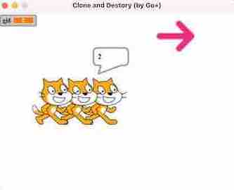

spx - A Go+ 2D Game Engine for STEM education
========

[](https://github.com/goplus/spx/actions/workflows/go.yml)
[](https://goreportcard.com/report/github.com/goplus/spx)
[](https://github.com/goplus/spx/releases)
[](https://github.com/goplus/gop)
[](https://pkg.go.dev/mod/github.com/goplus/spx)

## Tutorials

How to run spx tutorials?

* Download Go+ and build it. See https://github.com/goplus/gop#how-to-build.
* Download spx and build it.
  * git clone `git@github.com:goplus/spx.git`
  * cd spx
  * go install -v ./...
* Build tutorials and run.
  * cd tutorial/xxx
  * gop run .

### tutorial/01-Weather

 

Through this example you can learn how to listen events and do somethings.

Here are some codes in [Kai.spx](tutorial/01-Weather/Kai.spx):

```coffee
onStart => {
	setCostume "kai-a"
	play recordingWhere
	say "Where do you come from?", 2
	broadcast "1"
}

onMsg "2", => {
	play recordingCountry
	say "What's the climate like in your country?", 3
	broadcast "3"
}

onMsg "4", => {
	play recordingBest
	say "Which seasons do you like best?", 3
	broadcast "5"
}
```

We call `onStart` and `onMsg` to listen events. `onStart` is called when the program is started. And `onMsg` is called when someone calls `broadcast` to broadcast a message.

When the program starts, Kai says `Where do you come from?`, and then broadcasts the message `1`. Who will recieve this message? Let's see codes in [Jaime.spx](tutorial/01-Weather/Jaime.spx):

```coffee
onMsg "1", => {
	play recordingComeFrom
	say "I come from England.", 2
	broadcast "2"
}

onMsg "3", => {
	play recordingMild
	say "It's mild, but it's not always pleasant.", 4
	# ...
	broadcast "4"
}
```

Yes, Jaime recieves the message `1` and says `I come from England.`. Then he broadcasts the message `2`. Kai recieves it and says `What's the climate like in your country?`.

The following procedures are very similar. In this way you can implement dialogues between multiple actors.

### tutorial/02-Dragon


Through this example you can learn how to define variables and show them on the stage.

Here are all the codes of [Dragon](tutorial/02-Dragon/Dragon.spx):

```coffee
var (
	score int
)

onStart => {
	score = 0
	for {
		turn rand(-30, 30)
		step 5
		if touching("Shark") {
			score++
			play chomp, true
			step -100
		}
	}
}
```

We define a variable named `score` for `Dragon`. After the program starts, it moves randomly. And every time it touches `Shark`, it gains one score.

How to show the `score` on the stage? You don't need write code, just add a `stageMonitor` object into [resources/index.json](tutorial/02-Dragon/resources/index.json):

```json
{
  "zorder": [
    {
      "type": "stageMonitor",
      "target": "Dragon",
      "val": "getVar:score",
      "color": 15629590,
      "label": "score",
      "mode": 1,
      "x": 5,
      "y": 5,
      "visible": true
    }
  ]
}
```

### tutorial/03-Clone



Through this example you can learn:
* Clone sprites and destory them.
* Distinguish between sprite variables and shared variables that can access by all sprites.

Here are some codes in [Cat.spx](tutorial/03-Clone/Cat.spx):

```coffee
var (
	id int
)

onClick => {
	clone
}

onCloned => {
	gid++
	...
}
```

When we click the sprite `Cat`, it receives an `onClick` event. Then it calls `clone` to clone itself. And after cloning, the new `Cat` sprite will receive an `onCloned` event.

In `onCloned` event, the new `Cat` sprite uses a variable named `gid`. It doesn't define in [Cat.spx](tutorial/03-Clone/Cat.spx), but in [index.gmx](tutorial/03-Clone/index.gmx).


Here are all the codes of [index.gmx](tutorial/03-Clone/index.gmx):

```coffee
var (
	Arrow Arrow
	Cat   Cat
	gid   int
)

run "resources", {Title: "Clone and Destory (by Go+)"}
```

All these three variables in [index.gmx](tutorial/03-Clone/index.gmx) are shared by all sprites. `Arrow` and `Cat` are sprites that exist in this project. `gid` means `global id`. It is used to allocate id for all cloned `Cat` sprites.

Let's back to [Cat.spx](tutorial/03-Clone/Cat.spx) to see full coe of `onCloned`:

```coffee
onCloned => {
	gid++
	id = gid
	step 50
	say id, 0.5
}
```

It increases `gid` value and assign it to sprite `id`. This makes all these `Cat` have different `id`. Then the cloned `Cat` moves forward 50 steps and says `id` of itself.

Why these `Cat` sprites need different `id`? Because we want destory one of them by its `id`.

Here are all the codes in [Arrow.spx](tutorial/03-Clone/Arrow.spx):

```coffee
onClick => {
	broadcast "undo", true
	gid--
}
```

When we click `Arrow`, it broadcasts an "undo" message (NOTE: We pass the second parameter `true` to broadcast to indicate we wait all sprites finish processing this message).

All `Cat` sprites receive this message, but only the last cloned sprite finds its `id` is equal to `gid` then destroys itself. Here are the related codes in [Cat.spx](tutorial/03-Clone/Cat.spx):

```coffee
onMsg "undo", => {
	if id == gid {
		destroy
	}
}
```
