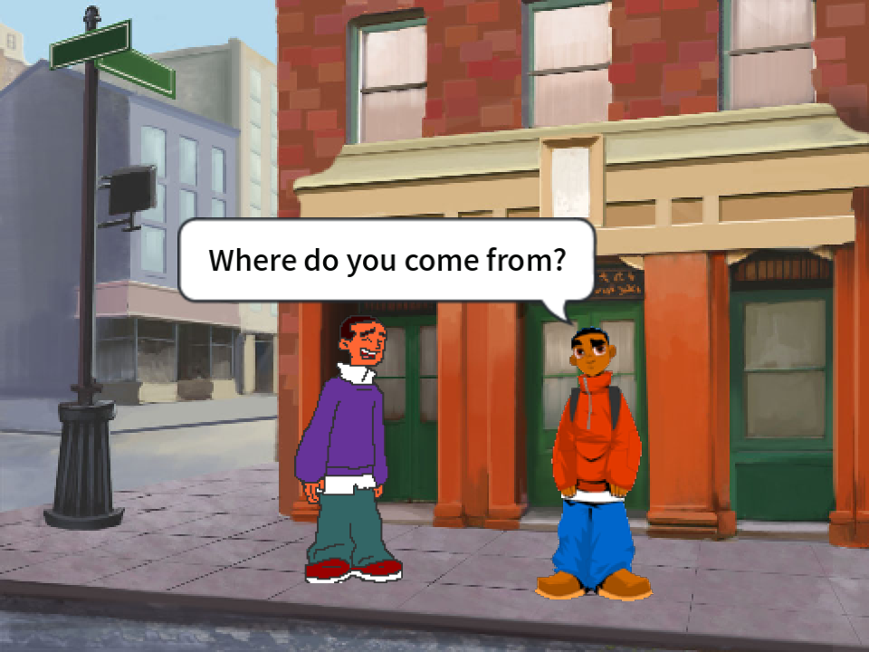
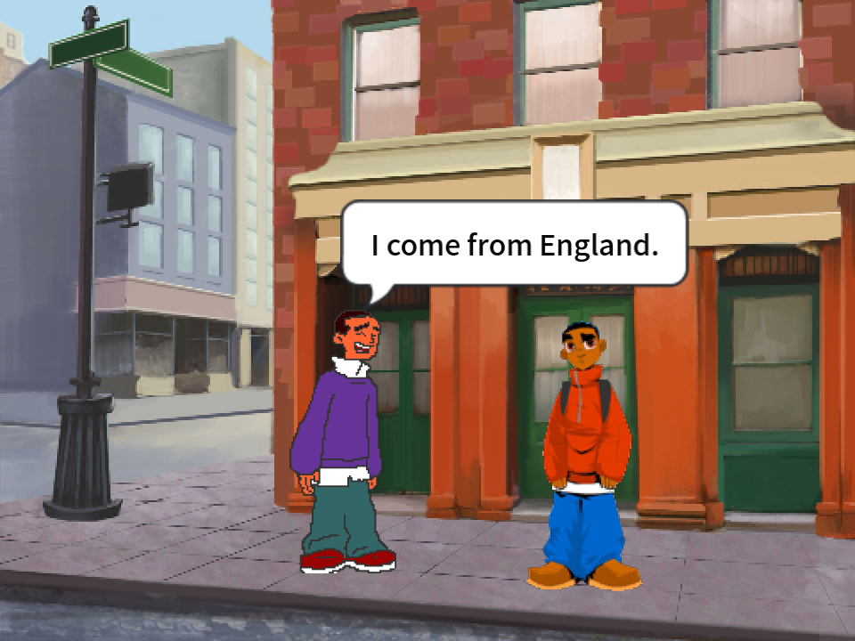
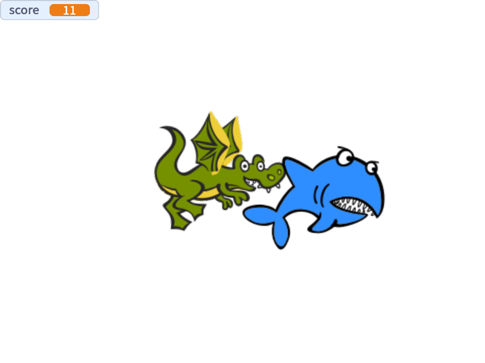
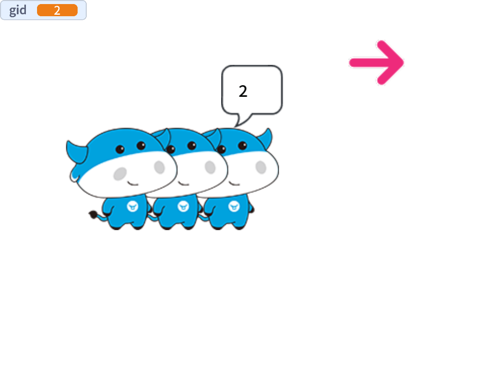
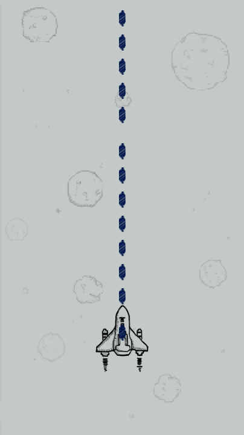

spx - A Scratch Compatible 2D Game Engine
========

[](https://github.com/goplus/spx/actions/workflows/runner.yml)
[](https://codecov.io/gh/goplus/spx/tree/dev)
[](https://github.com/goplus/spx/releases)
[](https://github.com/goplus/xgo)
[](https://github.com/xushiwei/goplus-spx-vs-scratch/blob/main/scratch-vs-spx-v1.0.0-beta3.pdf)

## How to build

Install Git, Make, Go, and the XGo CLI. Keep `$GOPATH/bin` on `PATH`; Windows
users should run the commands below from Git Bash and install
[`mingw-w64`](https://www.mingw-w64.org/). The authoritative Go, XGo, SCons,
EMSDK, NDK, and JDK versions live in
[`internal/release/runtime.lock.json`](internal/release/runtime.lock.json).
`buildctl` selects the locked Go toolchain and installs build-only tools such
as SCons when they are needed.

```sh
git clone https://github.com/goplus/spx.git
cd spx

# Download the locked published host runtime and install the spx command.
make setup
make doctor

# Discover and run repository demos.
make list-demos
make run DEMO_INDEX=1
```

Use `make help` for the supported entry points. To build the editor and all
runtime assets from local Godot source instead of downloading them:

```sh
GODOT_SRC=/absolute/path/to/godot make dev MODE=normal
```

To run an existing game directly, change to its root directory and run
`xgo run .`.


## Games powered by spx

* [AircraftWar](https://github.com/goplus/AircraftWar)
* [FlappyCalf](https://github.com/goplus/FlappyCalf)
* [MazePlay](https://github.com/goplus/MazePlay)
* [BetaGo](https://github.com/xushiwei/BetaGo)
* [Gobang](https://github.com/xushiwei/Gobang)
* [Dinosaur](https://github.com/xushiwei/Dinosaur)


## Tutorials

### tutorial/01-Weather

 

Through this example you can learn how to listen events and do somethings.

Here are some codes in [Kai.spx](tutorial/01-Weather/Kai.spx):

```coffee
onStart => {
    say "Where do you come from?", 2
    broadcast "1"
}

onMsg "2", => {
    say "What's the climate like in your country?", 3
    broadcast "3"
}

onMsg "4", => {
    say "Which seasons do you like best?", 3
    broadcast "5"
}
```

We call `onStart` and `onMsg` to listen events. `onStart` is called when the program is started. And `onMsg` is called when someone calls `broadcast` to broadcast a message.

When the program starts, Kai says `Where do you come from?`, and then broadcasts the message `1`. Who will recieve this message? Let's see codes in [Jaime.spx](tutorial/01-Weather/Jaime.spx):

```coffee
onMsg "1", => {
    say "I come from England.", 2
    broadcast "2"
}

onMsg "3", => {
    say "It's mild, but it's not always pleasant.", 4
    # ...
    broadcast "4"
}
```

Yes, Jaime recieves the message `1` and says `I come from England.`. Then he broadcasts the message `2`. Kai recieves it and says `What's the climate like in your country?`.

The following procedures are very similar. In this way you can implement dialogues between multiple actors.

### tutorial/02-Dragon



Through this example you can learn how to define variables and show them on the stage.

Here are all the codes of [Dragon](tutorial/02-Dragon/Dragon.spx):

```coffee
var (
    score int
)

onStart => {
    score = 0
    for {
        turn rand(-30, 30)
        step 5
        if touching("Shark") {
            waitNextFrame
            score++
            playAndWait "chomp"
            step -100
        }
    }
}
```

We define a variable named `score` for `Dragon`. After the program starts, it moves randomly. And every time it touches `Shark`, it gains one score.

How to show the `score` on the stage? You don't need to write code, just add a monitor object to `zorder` in [assets/index.json](tutorial/02-Dragon/assets/index.json). This excerpt shows the monitor configuration:

```json
{
  "zorder": [
    {
      "type": "monitor",
      "name": "monitor-1",
      "size": 1,
      "target": "Dragon",
      "val": "getVar:score",
      "color": 15629590,
      "label": "score",
      "mode": 1,
      "style": "scratch",
      "x": -240,
      "y": 180,
      "visible": true
    }
  ]
}
```

### tutorial/03-Clone



Through this example you can learn:
* Clone sprites and destroy them.
* Distinguish between sprite variables and shared variables accessible to all sprites.

Here are some codes in [Calf.spx](tutorial/03-Clone/Calf.spx):

```coffee
var (
    id int
)

onClick => {
    clone
}

onCloned => {
    gid++
    // ...
}
```

When we click the sprite `Calf`, it receives an `onClick` event. Then it calls `clone` to clone itself. And after cloning, the new `Calf` sprite will receive an `onCloned` event.

In the `onCloned` event, the new `Calf` sprite uses a variable named `gid`. It is defined in [main.spx](tutorial/03-Clone/main.spx), so all sprites share it. In contrast, `id` is defined in [Calf.spx](tutorial/03-Clone/Calf.spx), and each `Calf` instance has its own copy.


Here are all the codes of [main.spx](tutorial/03-Clone/main.spx):

```coffee
var (
    gid int
)
```

`gid` is the only variable declared in this file. It starts at zero and supplies IDs for cloned `Calf` sprites. The `Arrow` and `Calf` sprites have their own `.spx` files and are listed in [assets/index.json](tutorial/03-Clone/assets/index.json). This project does not need explicit sprite declarations or a `run` call in `main.spx`; run it with `xgo run .` from `tutorial/03-Clone`.

Let's back to [Calf.spx](tutorial/03-Clone/Calf.spx) to see the full codes of `onCloned`:

```coffee
onCloned => {
    gid++
    id = gid
    step 50
    say id, 0.5
}
```

Each clone increments the shared `gid` and stores the result in its own `id`. Then it moves forward 50 steps and says its ID. Undoing a clone decrements `gid`, so a later clone can reuse that ID.

Why do these `Calf` sprites need different IDs? Because we want to destroy the most recent clone by its ID.

Here are all the codes in [Arrow.spx](tutorial/03-Clone/Arrow.spx):

```coffee
onClick => {
    broadcastAndWait "undo"
    gid--
}
```

When we click `Arrow`, `broadcastAndWait "undo"` broadcasts the message and waits for its handlers to finish before decrementing `gid`.

While clones remain, all `Calf` sprites receive this message, but only the latest remaining clone has `id == gid` and destroys itself. Here is the handler in [Calf.spx](tutorial/03-Clone/Calf.spx):

```coffee
onMsg "undo", => {
    if id == gid {
        destroy
    }
}
```

This minimal example does not guard against undoing when `gid` is zero. Only click `Arrow` while clones remain; otherwise the original `Calf`, whose `id` is zero, also matches the condition, and `gid` becomes negative.

### tutorial/04-Bullet



Through this example you can learn:
* How to keep a sprite following mouse position.
* How to fire bullets.

It's simple to keep a sprite following mouse position. Here are some related codes in [MyAircraft.spx](tutorial/04-Bullet/MyAircraft.spx):


```coffee
onStart => {
    for {
        # ...
        setXYpos mouseX, mouseY
    }
}
```

Yes, we just need to call `setXYpos mouseX, mouseY` to follow mouse position.

But how to fire bullets? Let's see all codes of [MyAircraft.spx](tutorial/04-Bullet/MyAircraft.spx):

```coffee
onStart => {
    for {
        wait 0.1
        Bullet.clone
        setXYpos mouseX, mouseY
    }
}
```

In this example, `MyAircraft` fires bullets every 0.1 seconds. It just calls `Bullet.clone` to create a new bullet. All the rest things are the responsibility of `Bullet`.

Here are all the codes in [Bullet.spx](tutorial/04-Bullet/Bullet.spx):

```coffee
onCloned => {
    setXYpos MyAircraft.xpos, MyAircraft.ypos+5
    show
    for {
        wait 0.04
        step 10
        if touching(Edge) {
            destroy
        }
    }
}
```

When a `Bullet` is cloned, it calls `setXYpos MyAircraft.xpos, MyAircraft.ypos+5` to start just above `MyAircraft` and shows itself (the default state of a `Bullet` is hidden). Then it moves 10 steps every 0.04 seconds. Its [sprite configuration](tutorial/04-Bullet/assets/sprites/Bullet/index.json) sets its heading to `0`, so it travels upward.

When the `Bullet` touches the screen `Edge`, it destroys itself. This example has no enemies or enemy collision handler.

These are all things about firing bullets.
