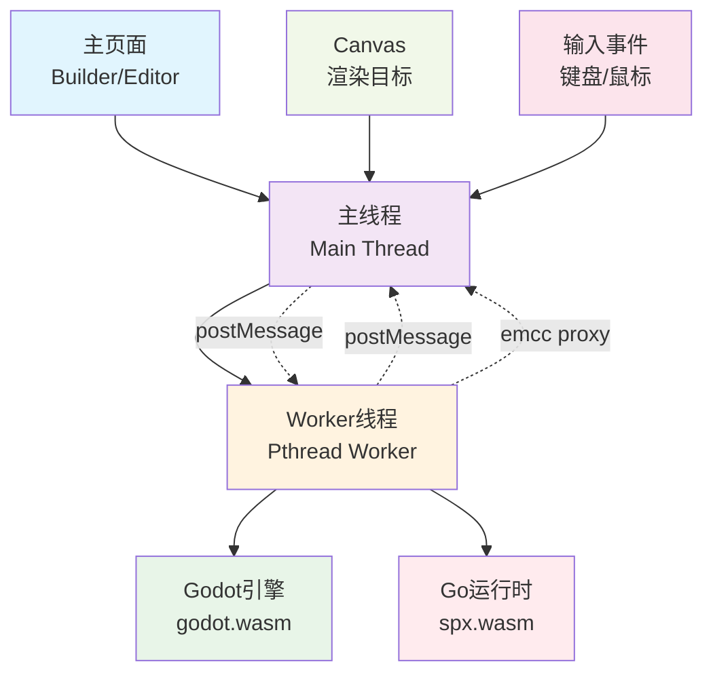
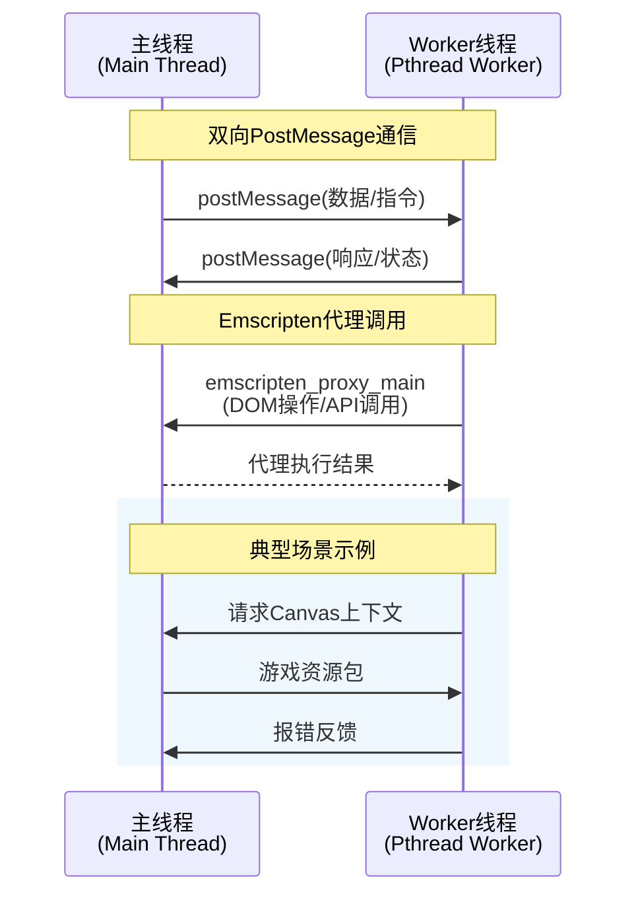
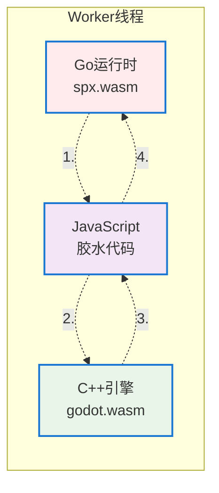
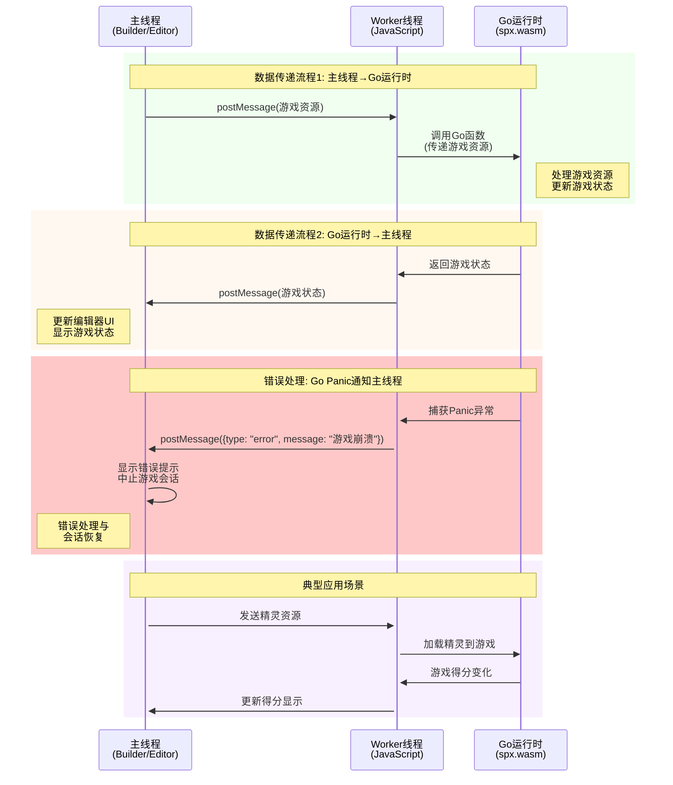
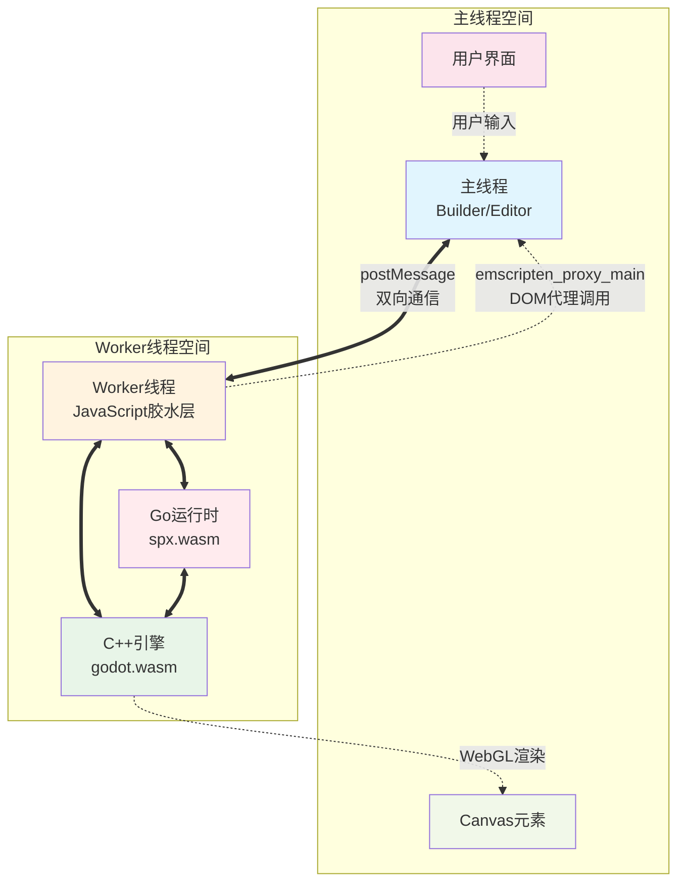
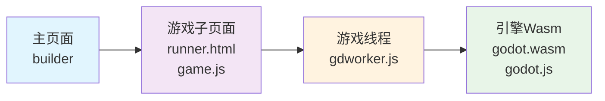
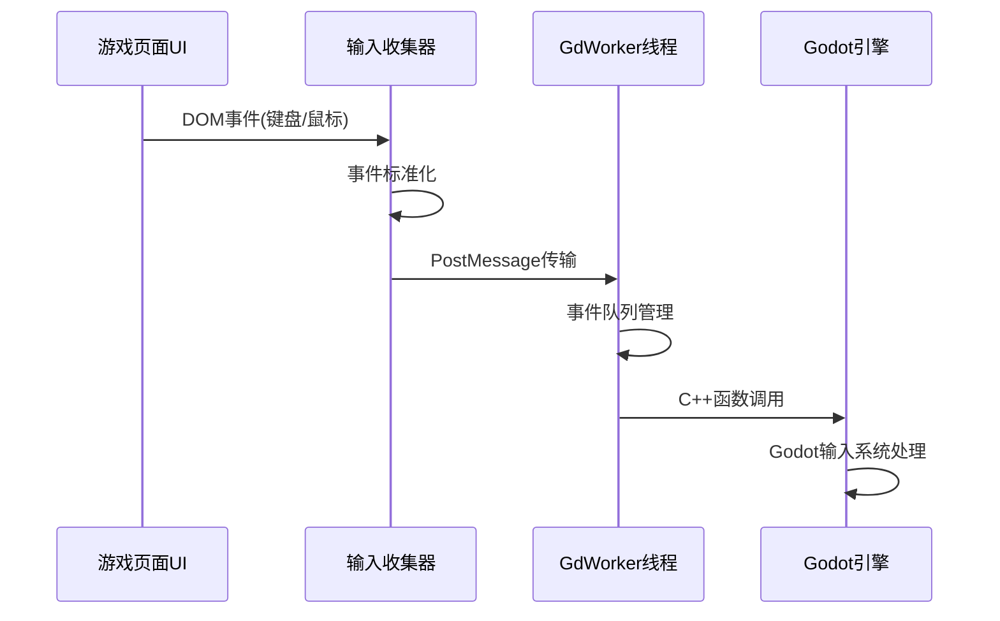

# Spx2 Web Worker线程

## 📚 目录

- [Spx2 Web Worker线程](#spx2-web-worker线程)
  - [📚 目录](#-目录)
  - [📋 需求](#-需求)
    - [🎯 核心需求](#-核心需求)
    - [🛡️ 解决的问题](#️-解决的问题)
  - [实现方案](#实现方案)
      - [1. 利用emcc的linker特性](#1-利用emcc的linker特性)
      - [2. 使用 worker 和 offscreenCanvas来实现](#2-使用-worker-和-offscreencanvas来实现)
  - [开发计划](#开发计划)
      - [1. 尝试方案1，看整合后是否能够符合预期](#1-尝试方案1看整合后是否能够符合预期)
      - [2. 如果方案1不符合预期，实现方案2](#2-如果方案1不符合预期实现方案2)
  - [🏗️ 系统架构(方案1)](#️-系统架构方案1)
    - [1. 编译配置 `proxy_to_pthread=true`](#1-编译配置-proxy_to_pthreadtrue)
    - [2. 系统架构组件](#2-系统架构组件)
    - [3. 通信机制与数据流](#3-通信机制与数据流)
  - [🏗️ 系统架构(方案2)](#️-系统架构方案2)
    - [🔧 组件职责](#-组件职责)
    - [🔄 数据流设计](#-数据流设计)
      - [1. **初始化阶段**](#1-初始化阶段)
      - [2. **运行时交互**](#2-运行时交互)
    - [🎮 输入处理](#-输入处理)
      - [1. **输入事件流转链路**](#1-输入事件流转链路)
      - [2. **输入事件类型与处理**](#2-输入事件类型与处理)
      - [3. **核心实现机制**](#3-核心实现机制)
    - [🔑 渲染处理](#-渲染处理)
      - [1. **Emscripten编译配置**](#1-emscripten编译配置)
      - [2. **WebGL2上下文创建与回退机制**](#2-webgl2上下文创建与回退机制)
      - [3. **核心实现概要**](#3-核心实现概要)
  - [📚 参考资源](#-参考资源)

---

## 📋 需求

让spx2游戏引擎能够运行在独立的Web Worker线程中，实现以下技术目标：

### 🎯 核心需求
- **线程隔离**：将游戏逻辑与主线程完全分离，避免游戏运行时的死循环、长时间计算等问题阻塞主页面UI
- **用户体验优化**：确保编辑器界面始终保持响应，用户可以随时停止或重启游戏，无需刷新整个页面
- **资源安全**：通过Worker沙箱机制，防止游戏代码意外访问或修改编辑器状态
- **性能提升**：利用浏览器多线程能力，实现真正的并行计算，提升整体性能

### 🛡️ 解决的问题
1. **主线程阻塞**：传统方式下游戏死循环会导致整个页面卡死
2. **调试困难**：游戏崩溃时难以保持编辑器状态，影响开发效率  
3. **内存隔离**：防止游戏内存泄漏影响编辑器稳定性
4. **错误隔离**：游戏运行时错误不会影响编辑器功能


---

## 实现方案
#### 1. 利用emcc的linker特性 
- 参考pr https://github.com/godotengine/godot/pull/79711

#### 2. 使用 worker 和 offscreenCanvas来实现 
- 参考项目 https://github.com/JiepengTan/wasm_worker_render_offscreen

## 开发计划
#### 1. 尝试方案1，看整合后是否能够符合预期
- 官方分支本地编译，增加测试demo，验收功能
- 整合进spx编译流程
- 根据问题，调整当前实现

#### 2. 如果方案1不符合预期，实现方案2
- 编译参数
- 增加gdworker
- 实现worker消息转发机制
- 处理渲染初始化 & 渲染循环
- 处理输入事件

## 🏗️ 系统架构(方案1)

基于Emscripten Proxy-to-Pthread的多线程架构，利用编译器原生支持实现主线程与游戏线程的自动分离。




### 1. 编译配置 `proxy_to_pthread=true`
**核心编译参数配置：**
```py
# Godot引擎编译配置
# Run the main application in a web worker
if env["proxy_to_pthread"]:
    env.Append(LINKFLAGS=["-s", "PROXY_TO_PTHREAD=1"])
    env.Append(CPPDEFINES=["PROXY_TO_PTHREAD_ENABLED"])
    env.Append(LINKFLAGS=["-s", "EXPORTED_RUNTIME_METHODS=['_emscripten_proxy_main']"])
    # https://github.com/emscripten-core/emscripten/issues/18034#issuecomment-1277561925
    env.Append(LINKFLAGS=["-s", "TEXTDECODER=0"])
    # BigInt support to pass object pointers between contexts
    needs_wasm_bigint = True
```

**技术特性说明：**

| 参数 | 作用 | 优势 |
|------|------|------|
| `PROXY_TO_PTHREAD=1` | 自动将主函数转移到Worker线程 | 编译器层级的线程隔离，无需手动管理 |
| `PTHREAD_POOL_SIZE=4` | 预分配4个Worker线程池 | 减少线程创建开销，提升响应速度 |


**实现细节：**

1. 通过 `__proxy: 'sync'` 标签进行标记
```js
	godot_audio_worklet_start__proxy: 'sync',
	godot_audio_worklet_start__sig: 'viiiii',
	godot_audio_worklet_start: function (p_in_buf, p_in_size, p_out_buf, p_out_size, p_state) {
		const out_buffer = GodotRuntime.heapSub(HEAPF32, p_out_buf, p_out_size);
		const in_buffer = GodotRuntime.heapSub(HEAPF32, p_in_buf, p_in_size);
		const state = GodotRuntime.heapSub(HEAP32, p_state, 4);
		GodotAudioWorklet.start(in_buffer, out_buffer, state);
	},
```

2. 通过 `ENVIRONMENT_IS_PTHREAD` 判断当前运行环境
```js
function _godot_audio_worklet_start(p_in_buf, p_in_size, p_out_buf, p_out_size, p_state) {
    if (ENVIRONMENT_IS_PTHREAD) return proxyToMainThread(53, 1, p_in_buf, p_in_size, p_out_buf, p_out_size, p_state);
    const out_buffer = GodotRuntime.heapSub(GROWABLE_HEAP_F32(), p_out_buf, p_out_size);
    const in_buffer = GodotRuntime.heapSub(GROWABLE_HEAP_F32(), p_in_buf, p_in_size);
    const state = GodotRuntime.heapSub(GROWABLE_HEAP_I32(), p_state, 4);
    GodotAudioWorklet.start(in_buffer, out_buffer, state);
}
```

3. 通过 `proxyToMainThread` 将函数调用转发到主线程
```js
function proxyToMainThread(index, sync) {
 var numCallArgs = arguments.length - 2;
 var outerArgs = arguments;
 var maxArgs = 19;
 if (numCallArgs > maxArgs) {
  throw "proxyToMainThread: Too many arguments " + numCallArgs + " to proxied function idx=" + index + ", maximum supported is " + maxArgs;
 }
 return withStackSave(() => {
  var serializedNumCallArgs = numCallArgs * 2;
  var args = stackAlloc(serializedNumCallArgs * 8);
  var b = args >> 3;
  for (var i = 0; i < numCallArgs; i++) {
   var arg = outerArgs[2 + i];
   if (typeof arg == "bigint") {
    HEAP64[b + 2 * i] = 1n;
    HEAP64[b + 2 * i + 1] = arg;
   } else {
    HEAP64[b + 2 * i] = 0n;
    GROWABLE_HEAP_F64()[b + 2 * i + 1] = arg;
   }
  }
  return __emscripten_run_in_main_runtime_thread_js(index, serializedNumCallArgs, args, sync);
 });
}

function withStackSave(f) {
    var stack = stackSave();
    var ret = f();
    stackRestore(stack);
    return ret;
}

```

### 2. 通信机制

#### 1. 主线程与Worker线程通信



#### 2. Go运行时与C++Engine通信



#### 3. 主线程与Go运行时通信



#### 4. 通信机制总览



## 🏗️ 系统架构(方案2)

基于Web Worker + OffscreenCanvas的多线程游戏引擎架构，实现主线程与游戏线程的完全隔离。



### 🔧 组件职责

| 组件 | 职责 | 技术栈 |
|------|------|--------|
| **主页面(Builder)** | 编辑器界面、项目管理、游戏生命周期控制 | HTML/CSS/JavaScript |
| **游戏子页面(Runner)** | 游戏容器、输入事件捕获、Canvas管理 | HTML5 + OffscreenCanvas |
| **游戏线程(GdWorker)** | 线程隔离、消息路由、WebGL上下文管理 | Web Worker + WebGL2 |
| **引擎Wasm** | 游戏逻辑执行、渲染管线、物理计算 | Godot Engine + WebAssembly |

### 🔄 数据流设计

#### 1. **初始化阶段**
- **主页面** → 创建游戏子页面iframe → 管理游戏会话
- **游戏子页面** → 创建OffscreenCanvas → 设置输入监听 → 启动Worker线程
- **GdWorker线程** → 初始化WebGL2上下文 → 加载WASM模块 → 建立渲染管线
- **WASM引擎** → 初始化Godot运行时 → 加载游戏资源 → 启动主循环

#### 2. **运行时交互**
- **输入处理**：游戏页面 → 事件捕获 → Worker消息 → WASM处理 → 游戏状态更新
- **渲染循环**：WASM渲染 → WebGL2调用 → OffscreenCanvas → 主线程显示
- **状态同步**：游戏状态 → Worker消息 → 子页面 → 主页面通知


### 🎮 输入处理

#### 1. **输入事件流转链路**


#### 2. **输入事件类型与处理**

| 输入类型 | 事件源 | 处理流程 | 数据格式 |
|----------|--------|----------|----------|
| **键盘输入** | `keydown/keyup` | DOM事件 → 标准化 → Worker → WASM | `{type:'key', code:string, pressed:bool, modifiers:object}` |
| **鼠标移动** | `mousemove` | 相对/绝对坐标 → Worker → WASM | `{type:'mouse_motion', pos:{x,y}, relative:{x,y}}` |
| **鼠标点击** | `mousedown/up` | 按键状态 → Worker → WASM | `{type:'mouse_button', button:int, pressed:bool}` |

#### 3. **核心实现机制**

**1. 输入收集器 (Input Collector)**
```javascript
class GodotWorkerInput {
    constructor(worker, canvas) {
        this.worker = worker;
        this.canvas = canvas;
        this.setupInputCollection();
    }
    
    setupInputCollection() {
        // 键盘事件捕获
        document.addEventListener('keydown', (e) => {
            this.sendInputEvent({
                type: 'key',
                code: e.code,
                scancode: e.which,
                pressed: true,
                modifiers: this.getModifiers(e)
            });
        });
        
        // 鼠标事件捕获
        this.canvas.addEventListener('mousemove', (e) => {
            this.sendInputEvent({
                type: 'mouse_motion',
                position: { x: e.offsetX, y: e.offsetY },
                relative: { x: e.movementX, y: e.movementY }
            });
        });
    }
    
    sendInputEvent(inputData) {
        this.worker.postMessage({
            cmd: 'input_event',
            data: inputData,
            timestamp: performance.now()
        });
    }
}
```

**2. Worker端事件转发**
```javascript
// gdworker.js 中的输入处理
self.onmessage = function(e) {
    if (e.data.cmd === 'input_event') {
        const inputData = e.data.data;
        
        // 根据输入类型调用对应的WASM函数
        switch(inputData.type) {
            case 'key':
                Module._handle_key_input(
                    inputData.code,
                    inputData.pressed,
                    inputData.modifiers
                );
                break;
            case 'mouse_motion':
                Module._handle_mouse_motion(
                    inputData.position.x,
                    inputData.position.y,
                    inputData.relative.x,
                    inputData.relative.y
                );
                break;
        }
    }
};
```

**3. WASM端输入处理**
```c
// Godot引擎中的输入处理适配
EMSCRIPTEN_KEEPALIVE
void handle_key_input(const char* key_code, bool pressed, int modifiers) {
    // 创建Godot InputEvent
    InputEventKey* key_event = memnew(InputEventKey);
    key_event->set_keycode(string_to_keycode(key_code));
    key_event->set_pressed(pressed);
    key_event->set_shift_pressed(modifiers & SHIFT_MASK);
    key_event->set_ctrl_pressed(modifiers & CTRL_MASK);
    
    // 传递给Godot输入系统
    Input::get_singleton()->parse_input_event(key_event);
}
```

---

### 🔑 渲染处理

#### 1. **Emscripten编译配置**

```bash
# 假定编译 demo.c 
emcc demo.c -o demo.js \
    -s WASM=1 \
    -s USE_WEBGL2=1 \
    -s OFFSCREENCANVAS_SUPPORT=1 \
    -s EXPORTED_FUNCTIONS="['_main','_init_libs','_frame','_start_rendering','_stop_rendering','_set_key_state','_set_move_speed','_handle_mouse_move','_handle_mouse_button','_handle_resize','_cleanup','_malloc','_free']" \
    -s EXPORTED_RUNTIME_METHODS="['ccall','cwrap','stringToNewUTF8']" \
    -s MODULARIZE=1 \
    -s EXPORT_NAME=Module \
    -s ENVIRONMENT=worker \
    -s ALLOW_MEMORY_GROWTH=1 \
    -s NO_EXIT_RUNTIME=1 \
    -O2
```

#### 2. **WebGL2上下文创建与回退机制**

```javascript
webglContext = canvas.getContext('webgl2', contextOptions);

if (webglContext) {
    const ext = webglContext.getExtension('EXT_color_buffer_float');
} else {
    webglContext = canvas.getContext('webgl', contextOptions);
}

// Worker环境WebGL上下文绑定
try {
    WasmModuleInstance.ctx = webglContext;
    WasmModuleInstance.GLctx = webglContext;
    WasmModuleInstance.canvas = canvas;
    return true;
} catch (fallbackError) {
    return false;
}
```


#### 3. **核心实现概要**

```cpp
// godot/platform/web/display_server_web.h
class DisplayServerWeb : public DisplayServer {
private:
    bool is_worker_context = false;
    OffscreenCanvas* worker_canvas = nullptr;
    
public:
    void init_worker_context(OffscreenCanvas* canvas) {
        worker_canvas = canvas;
        is_worker_context = true;
        
        // 初始化WebGL2上下文
        EmscriptenWebGLContextAttributes attrs;
        emscripten_webgl_init_context_attributes(&attrs);
        attrs.majorVersion = 2;
        attrs.minorVersion = 0;
        
        webgl_ctx = emscripten_webgl_create_context("#canvas", &attrs);
        emscripten_webgl_make_context_current(webgl_ctx);
        // ...
    }
    
};
```


## 📚 参考资源

- [Emscripten 线程相关文档](https://emscripten.org/docs/porting/pthreads.html#additional-flags)
- [OffscreenCanvas MDN](https://developer.mozilla.org/en-US/docs/Web/API/OffscreenCanvas)
- [WebGL2 规范](https://www.khronos.org/registry/webgl/specs/latest/2.0/)
- [Godot Web平台文档](https://docs.godotengine.org/en/stable/tutorials/export/exporting_for_web.html)

- [OffscreenCanvas Worker wasm 技术验证](https://github.com/JiepengTan/wasm_worker_render_offscreen)

---
