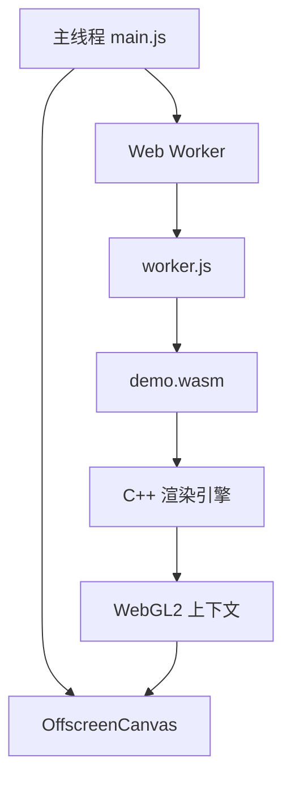

# WebGL2 OffscreenCanvas WASM C++ 渲染技术测试

## 📋 项目概述
本项目验证了在独立Web Worker中使用OffscreenCanvas进行真正的C++ WebGL2渲染.
- [OffscreenCanvas Worker wasm 技术验证](https://github.com/JiepengTan/wasm_worker_render_offscreen)


---

## 🏗️ 系统架构



### 🔄 数据流
1. **主线程** → 创建OffscreenCanvas → 传递给Worker
2. **Worker** → 创建WebGL2上下文 → 设置Emscripten绑定
3. **WASM** → 加载C++渲染引擎 → 初始化OpenGL资源
4. **C++** → 渲染循环 → 直接调用WebGL2 API
5. **GPU** → 渲染结果 → OffscreenCanvas → 主线程显示

---

## 🔑 关键实现点

### 1. **WebGL2上下文创建与回退机制**

```javascript
webglContext = canvas.getContext('webgl2', contextOptions);

if (webglContext) {
    const ext = webglContext.getExtension('EXT_color_buffer_float');
} else {
    webglContext = canvas.getContext('webgl', contextOptions);
}
```

### 2. **Emscripten编译配置**

```bash
emcc demo.c -o demo.js \
    -s WASM=1 \
    -s USE_WEBGL2=1 \
    -s OFFSCREENCANVAS_SUPPORT=1 \
    -s EXPORTED_FUNCTIONS="['_main','_init_libs','_frame','_start_rendering','_stop_rendering','_set_key_state','_set_move_speed','_handle_mouse_move','_handle_mouse_button','_handle_resize','_cleanup','_malloc','_free']" \
    -s EXPORTED_RUNTIME_METHODS="['ccall','cwrap','stringToNewUTF8']" \
    -s MODULARIZE=1 \
    -s EXPORT_NAME=Module \
    -s ENVIRONMENT=worker \
    -s ALLOW_MEMORY_GROWTH=1 \
    -s NO_EXIT_RUNTIME=1 \
    -O2
```

### 4. **C++ WebGL资源初始化**

```c
EMSCRIPTEN_KEEPALIVE
void init_webgl() {
    webgl_context = emscripten_webgl_get_current_context();
}
```

### 5. **核心渲染循环**

```c
void render_webgl_frame() {
    if (!is_initialized || webgl_context <= 0) return;
    
    if (emscripten_webgl_get_current_context() != webgl_context) {
        emscripten_webgl_make_context_current(webgl_context);
    }
    glClear(GL_COLOR_BUFFER_BIT | GL_DEPTH_BUFFER_BIT);
    glFlush();
}
```

### 6. **键盘输入处理**

```c
EMSCRIPTEN_KEEPALIVE
void set_key_state(const char* key, bool is_pressed) {
    if (!key) return;
}
```

---

## 🛠️ 技术难点与解决方案

### 1. **Worker环境WebGL上下文绑定**

**难点**：Emscripten在Worker环境中无法直接访问`document`对象

**解决方案**：
```javascript
try {
    WasmModuleInstance.ctx = webglContext;
    WasmModuleInstance.GLctx = webglContext;
    WasmModuleInstance.canvas = canvas;
    return true;
} catch (fallbackError) {
    return false;
}
```

### 2. **字符串内存管理**

**解决方案**：
```javascript
let keyPtr;
if (typeof WasmModuleInstance.stringToNewUTF8 === 'function') {
    keyPtr = WasmModuleInstance.stringToNewUTF8(key);
} else if (typeof WasmModuleInstance._malloc === 'function') {
    const keyBytes = new TextEncoder().encode(key + '\0');
    keyPtr = WasmModuleInstance._malloc(keyBytes.length);
    WasmModuleInstance.HEAPU8.set(keyBytes, keyPtr);
}

if (typeof WasmModuleInstance._free === 'function') {
    WasmModuleInstance._free(keyPtr);
}
```

---

## 🎮 Godot引擎集成扩展

### 🔑 关键适配点

#### 1. **Godot Platform Web模块修改**

```cpp
// godot/platform/web/display_server_web.h
class DisplayServerWeb : public DisplayServer {
private:
    bool is_worker_context = false;
    OffscreenCanvas* worker_canvas = nullptr;
    
public:
    void init_worker_context(OffscreenCanvas* canvas) {
        worker_canvas = canvas;
        is_worker_context = true;
        
        // 初始化WebGL2上下文
        EmscriptenWebGLContextAttributes attrs;
        emscripten_webgl_init_context_attributes(&attrs);
        attrs.majorVersion = 2;
        attrs.minorVersion = 0;
        
        webgl_ctx = emscripten_webgl_create_context("#canvas", &attrs);
        emscripten_webgl_make_context_current(webgl_ctx);
    }
    
    void handle_worker_input(const InputEvent& event) {
        // 处理从主线程传来的输入事件
        Input::get_singleton()->parse_input_event(event);
    }
};
```

#### 2. **输入系统Worker适配**

```javascript
// godot_worker_input.js
class GodotWorkerInput {
    constructor(worker) {
        this.worker = worker;
        this.setupInputCollection();
    }
    
    setupInputCollection() {
        // 键盘事件
        document.addEventListener('keydown', (e) => {
            this.sendToWorker({
                type: 'input_key',
                keycode: e.code,
                scancode: e.which,
                pressed: true,
                modifiers: {
                    shift: e.shiftKey,
                    ctrl: e.ctrlKey,
                    alt: e.altKey,
                    meta: e.metaKey
                }
            });
        });
        
        // 鼠标事件
        this.canvas.addEventListener('mousemove', (e) => {
            this.sendToWorker({
                type: 'input_mouse_motion',
                position: { x: e.offsetX, y: e.offsetY },
                relative: { x: e.movementX, y: e.movementY }
            });
        });
    }
    
    sendToWorker(inputData) {
        this.worker.postMessage({
            type: 'godot_input',
            data: inputData,
            timestamp: performance.now()
        });
    }
}
```


## 📚 参考资源

### 官方文档
- [Emscripten 线程相关文档](https://emscripten.org/docs/porting/pthreads.html#additional-flags)
- [OffscreenCanvas MDN](https://developer.mozilla.org/en-US/docs/Web/API/OffscreenCanvas)
- [WebGL2 规范](https://www.khronos.org/registry/webgl/specs/latest/2.0/)
- [Godot Web平台文档](https://docs.godotengine.org/en/stable/tutorials/export/exporting_for_web.html)

---
