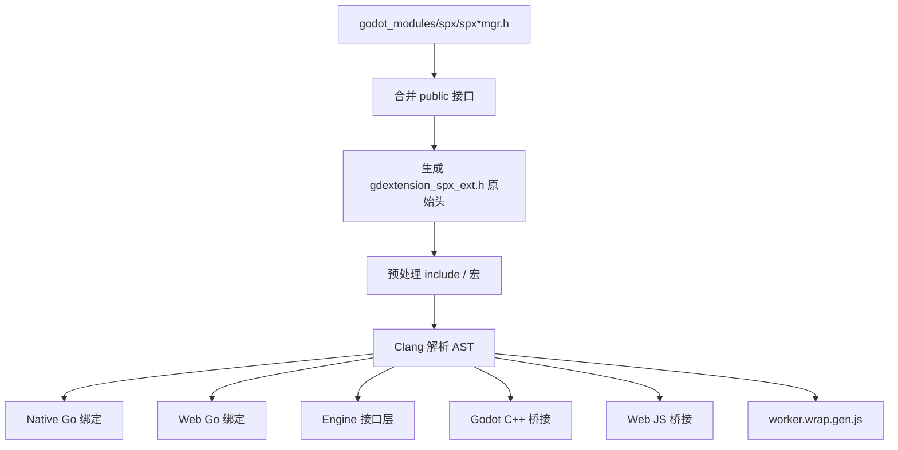

# SPX 绑定代码生成系统

本文档说明 SPX 当前的绑定代码生成链路，覆盖以下内容：

- Godot `spx` 模块头文件如何进入生成流程
- Go / Web / Native / Godot C++ 侧分别生成哪些文件
- 新增一个 manager 接口时应该改哪里
- 出现生成异常时优先看哪些位置

这里讨论的是 `internal/cmd/codegen` 这一套绑定生成器，不包含 `make generate-runtime` 触发的其他 `go generate` 任务。

## 1. 常用命令

最常用的入口有两个：

```bash
make generate-bindings
make generate
```

它们在 `Makefile` 中的定义如下：

- `make generate-bindings`
  - 执行 `cd ./internal/cmd/codegen && go run .`（`SPX_MODULE_SRC` 由顶层 Make 环境统一导出）
  - 只生成绑定相关代码
- `make generate`
  - 先执行 `generate-bindings`
  - 再执行 `generate-runtime`
  - 最后执行 `format`

如果没有显式传入 `SPX_MODULE_SRC`，生成器默认读写仓库下的 `./godot_modules/spx`。相对覆盖路径从 SPX 仓库根目录解析。

生成器自身是一个 nested Go module，并通过本地 `replace` 指回仓库根目录。因此其中的 `github.com/goplus/spx/v3 v3.0.0` 只是 `go run` 所需的最小合法 v3 module 版本，不是发布版本声明，SPX 发版时不要跟随提升。

推荐用法：

```bash
SPX_MODULE_SRC=/path/to/spx-module make generate-bindings
```

## 2. 整体链路

当前生成流程可以概括为：


```mermaid
graph TD
    A[godot_modules/spx/spx*mgr.h] --> B[合并 public 接口]
    B --> C[生成 gdextension_spx_ext.h 原始头]
    C --> D[预处理 include / 宏]
    D --> E[Clang 解析 AST]
    E --> F[Native Go 绑定]
    E --> G[Web Go 绑定]
    E --> H[Engine 接口层]
    E --> I[Godot C++ 桥接]
    E --> J[Web JS 桥接]
    E --> K[worker.wrap.gen.js]
```

`internal/cmd/codegen/main.go` 中的主流程分成三步：

1. `gdext.GenerateHeader(...)`
   - 从 Godot `spx` 模块头文件生成 `gdextension_spx_ext.h`
2. `gdextensionparser.GenerateGDExtensionInterfaceAST(...)`
   - 展开 include、预处理宏、生成 AST
3. `ffi.Generate(...)`、`webffi.Generate(...)`、`gdext.Generate(...)`
   - 基于 AST 生成 Go / JS / C++ 绑定

## 3. 关键目录与产物

### 3.1 输入源

真正的接口来源是 SPX 仓库自有模块中的 manager 头文件：

- `$(SPX_MODULE_SRC)/spx*mgr.h`

当前生成器只会扫描：

- 文件名匹配 `spx*mgr.h`
- `public:` 区域中的方法
- 带 `SPX_BIND` 标记的方法

不会进入生成流程的内容包括：

- `spx_base_mgr.h`
- `spx_object_mgr.h`
- 没有 `SPX_BIND` 的 helper 方法
- 内联函数定义
- 注释内容

### 3.2 中间文件

生成过程中常见的中间文件有两个：

- `internal/gdengine/binding/native/gdextension_spx_codegen_header.h`
  - AST 解析入口头文件
- `internal/gdengine/binding/native/_temp_output.h`
  - include 展开后的临时头文件

另外，默认还会在 `internal/cmd/codegen` 工作目录下写出：

- `_debug_parsed_ast.json`

这个 JSON 很适合调试“为什么某个方法没被识别”。

### 3.3 主要输出文件

按目标侧分类，当前会生成以下内容：

#### Native 绑定

- `internal/gdengine/binding/native/ffi_wrapper.gen.h`
- `internal/gdengine/binding/native/ffi_wrapper.gen.go`
- `internal/gdengine/binding/native/ffi.gen.go`

#### Web 绑定

- `internal/gdengine/binding/web/callbacks.gen.go`
- `internal/gdengine/binding/web/ffi.gen.go`

#### 引擎实现层

- `internal/gdengine/impl/manager_native.gen.go`
- `internal/gdengine/impl/manager_web.gen.go`

#### 引擎同步包装层

- `internal/enginewrap/sync.gen.go`
- `internal/enginewrap/sync_pure.gen.go`

#### 对外 Go API

- `pkg/spx/pkg/engine/interface.gen.go`
- `pkg/spx/pkg/engine/sprite.gen.go`
- `pkg/spx/pkg/engine/sprite_pure.gen.go`

#### Godot C++ / Web JS 注入文件

- `godot_modules/spx/gdextension_spx_ext.h`
- `godot_modules/spx/gdextension_spx_ext.cpp`
- `godot_modules/spx/web/godot_js_spx.cpp`
- `godot_modules/spx/web/js/engine/gdspx.js`

#### Web Worker 包装文件

- `cmd/spx/template/platform/webworker/worker.wrap.gen.js`

## 4. 代码结构

### 4.1 主入口

`internal/cmd/codegen/main.go`

负责串起整条生成链路：

- 计算默认 `SPX_MODULE_SRC`
- 触发 header 生成
- 触发 AST 解析
- 分别调度 `ffi`、`webffi`、`gdext`

### 4.2 Header 收集与 ABI 入口生成

`internal/cmd/codegen/generate/gdext/header.go`

这是整个系统最关键的入口之一，负责：

- 扫描 `spx*mgr.h`
- 提取 manager 名称
- 收集 `SPX_BIND` 方法
- 生成 `GDExtensionSpx...` 形式的 typedef
- 从声明记录静态调用目标、原生数组方向和长度，以及返回值降为输出参数后的身份

### 4.3 AST 解析

`internal/cmd/codegen/gdextensionparser/parse.go`

流程如下：

1. 找到项目根目录
2. 读取 `gdextension_spx_codegen_header.h`
3. 展开本地 include
4. 交给 `preprocessor` 做预处理
5. 调用 `clang.ParseCString(...)` 得到 AST
6. 按需写出 `_debug_parsed_ast.json`

`generate/common/parameters.go` 在上下文创建时整理每个参数的公开名称、Go 类型、ABI 位置及数组长度对应关系。Native 和 Web 共用这份参数描述。返回参数由 header 元数据显式标记，用户声明中的 `ret_value` 不会仅因名称相同而被当作返回值。

### 4.4 模板生成

模板主要分布在以下目录：

- `internal/cmd/codegen/generate/ffi`
- `internal/cmd/codegen/generate/webffi`
- `internal/cmd/codegen/generate/gdext`

公共辅助逻辑在：

- `internal/cmd/codegen/generate/common/funcs.go`

`GenerateFile(...)` 会统一做几件事：

- 渲染模板
- 给 `.go` 文件补 license header
- 对生成的 Go 文件执行 `go fmt`
- 对生成的 Go 文件执行 `goimports -w`

所以日常维护时，应该改模板，不要直接改 `.gen.go`。

## 5. 接口导出规则

### 5.1 基本规则

一个方法要进入绑定生成，至少要满足：

1. 位于 `public:` 区域
2. 使用无参数宏 `SPX_BIND`，在 C++ 中展开为空
3. 每行一个声明，参数和返回值采用生成器支持的类型

manager 类通过 `spx*mgr.h` 中的 `Spx*Mgr` 名称识别，不再要求继承 `SpxBaseMgr` 或 `SpxObjectMgr`。修改继承不会删除导出接口；修改类名仍会改变对应 ABI 名称。

典型例子：

```cpp
class SpxSpriteMgr {
public:
    SPX_BIND void batch_update_transforms(GdArray buffer);
    SPX_BIND GdBool destroy_sprite(GdObj obj);
};
```

### 5.2 直接原生数组桥接

即使没有高层 `GdArray` 版本，只要签名是这种模式：

```cpp
SPX_BIND void batch_update_transforms(const float *buffer_data, int len);
```

生成器会将它记录为统一的 `ArrayBridge`。每个参数对记录为一个 `ArrayBuffer`，保存在 `Buffers` 中；`const` 指针只读，可写指针允许回写。缓冲区名称由指针参数名解析，并去掉 `_data` 后缀。

输入和原地写入输出的缓冲区由调用者提供。例如：

```cpp
SPX_BIND void write_snapshot(SPX_OUT float out[3]);
```

生成器从原始声明的 `[3]` 提取 `ArrayBuffer.Count`，然后将参数降为指针 ABI，不再传长度参数。高层接口为 `WriteSnapshot(out *[3]float32)`，保持原地写入；Go 绑定拒绝 nil，Web 绑定在调用前检查原生输出数组长度恰好为 3。动态切片在 Go 调用前检查长度能否用 int32 表示。

固定数组和动态数组使用相同的类型映射，支持 `float` / `real_t`、`int64_t`、`uint8_t` 和 `GdObj`。固定数组、动态数组和普通参数可以在同一个方法中组合使用；默认返回 `void`，包含 `SPX_OUT` 的方法也可以返回 `GdBool` 表示整体成功或失败；`const T input[N]` 为只读输入，`T out[N]` 为可写缓冲区。固定长度须为正的十进制 int32 字面量，常量名、表达式和多维数组会被拒绝，固定数组后不再附加长度参数。C++ 数组参数本身会退化为指针，不提供容量检查。

对于返回 `void` 且仅有一个固定 `SPX_OUT` 数组参数的方法，Web 还会生成 `GdspxFuncs['arrayOutputs']['gdspx_input_write_snapshot']()` 读取入口，按声明的类型和数量分配原生数组并返回。新增固定输出方法只需添加声明，无需手写 JS 包装；底层内存分配共用 `ReadArrayOutput`。

目前内建支持的原始数组类型主要包括：

- `float *` / `real_t *`
- `int64_t *`
- `uint8_t *`
- `GdObj *`（Go 使用 `[]int64`，保留完整的对象 ID 位模式）

数组的 ABI 编号、描述符标记、元素名称、固定元素字节数及 Go/C 类型映射统一定义在 `generate/common/arrays.go`。C 头文件的枚举、Web Go 的 `arrays.gen.go` 和 `gdspx.util.js` 中标记的数组 ABI 区域均由这份定义生成，包括 Go/JS 的元素大小查询函数，无需分别手写。扩展类型时仍须确认原生端与 Web 端支持对应的元素布局。

### 5.3 独立长度的原生输入、输出数组

每个动态原生数组使用相邻的“指针 + 长度”参数对，长度直接从声明解析，`SPX_OUT` 仅标记只输出方向：

```cpp
SPX_BIND GdBool batch_retrieve_positions(const GdObj *objs, int count, SPX_OUT float *out, int out_len);
```

Go 接口为 `BatchRetrievePositions(objs []int64, out []float32) bool`。生成器分别从 `len(objs)` 和 `len(out)` 传入 `count` 和 `out_len`，不约束输入和输出元素数相等，也不推导比例。多个输入、输出缓冲区按声明顺序处理，动态缓冲区使用各自的长度参数，固定数组从声明解析大小；`const` 指针只读，可写数组在输出有效时复制回对应的 Go 切片。

普通参数可以穿插在数组参数之间，例如：

```cpp
SPX_BIND void sample(int mode, const float *values, int count, SPX_OUT float out[3]);
```

对应 Go 接口为 `Sample(mode int32, values []float32, out *[3]float32)`。`mode` 正常传值，`count` 从输入切片长度获得，固定输出不传额外长度。`GdString` 等需要临时内存的普通参数也可混用；Web 生成器只为需要释放的值生成清理逻辑，校验或调用失败时仍执行释放。

输出容量由调用方提供，记录格式和容量校验由具体函数负责。例如位置查询需要每个对象对应两个坐标，因此调用方为 N 个对象提供恰好 2N 个 `float32` 元素（底层缓存可以更大，传入切片限定本次写入范围）；C++ 在写入前检查线程、长度、空指针和数量溢出，失败返回 `false` 且所有输出保持不变，成功完整写入并返回 `true`，缺失精灵写为一对 NaN。空输入配合空输出也返回 `true`。这个比例只属于位置函数，不属于生成器规则。

Go 调用侧通过已有的 `SpriteSyncBuffer.GetPositions` 保存并复用位置输出缓冲区，缓存随游戏实例持有，容量不足时扩容；查询失败返回空结果，避免应用旧坐标。Native 绑定直接传递两个切片的地址和各自长度，C++ 无需分配数组。Web 使用已有 Wasm 内存池，并将可写输出字节直接复制回原 Go 切片，不分配解码结果数组；Go Wasm 和引擎 Wasm 内存独立，两者间仍需要字节复制。缓冲区复用不代表缓存坐标结果，数据每次调用都会刷新。

这类方法使用 `ArrayBridge.Buffers` 保存按声明顺序排列的原生缓冲区；生成器不解析记录结构，也不使用 `GdArray` 的 C++ 包装和结果分配路径。

`SPX_OUT` 放在数组参数类型之前，在 C++ 中展开为空，由生成器记录只输出方向：

| 参数声明 | Web 调用前 | Web 调用后 |
| --- | --- | --- |
| `const T *input, int len` | 复制输入 | 不回写 |
| `T *buffer, int len` | 复制旧内容 | 回写 |
| `SPX_OUT T *out, int len` / `SPX_OUT T out[N]` | 只借用存储，不复制、不清零 | 输出有效时回写 |

调用方确保每个输出切片长度等于本次写入元素数，函数不读取旧值，并完整覆盖所有 `SPX_OUT` 范围。`void` 方法正常返回即表示输出有效；返回 `GdBool` 的方法，`true` 表示全部输出完整，`false` 表示所有可写数组均未修改，Web 跳过所有数组回写。Native 直接使用调用方地址，因此 C++ 必须在开始写入前完成所有可能失败的校验。多个输出各自声明长度，共用整体成功状态，不需要额外的实际写入数量。

`SPX_OUT` 不允许标记 `const`、普通参数或不支持的数组类型。固定只输出数组在 JS 入口也要求长度完全匹配。自动无参数读取入口仅用于单个固定输出且返回 `void` 的方法，避免丢失成功状态或把读写数组误当输出。

### 5.4 静态方法与内存所有权

不需要 manager 实例的方法，直接使用普通 C++ `static` 声明：

```cpp
class SpxExtMgr {
public:
    SPX_BIND static void request_reset(GdInt exit_code);
    SPX_BIND static GdBool is_paused();
};
```

Native 和普通 Web 桥接分别调用 `SpxExtMgr::request_reset`、`SpxExtMgr::is_paused`，由 C++ 实现转发到 `Spx` 生命周期入口。其他声明通过 manager 实例调用。生成器从声明推导调用目标，静态方法和实例方法共用参数、返回值转换规则。`static` 只表达不需要实例，线程安全仍由具体实现保证。

Go 和 JavaScript 字符串由各自语言管理内存，manager 接口中没有 `FreeStr`。原始 Native 字符串通过 builtin `GDExtensionSpxGlobalFreeString` / `spx_global_free_string` 释放，入口直接调用 `SpxAbi::free_return_cstr`，不查找 Engine 或 manager。普通方法返回的字符串由调用方持有，Native `ToString` 先复制，再调用这个 builtin 释放。回调字符串参数只在同步调用期间借用：Native 复制成 Go 字符串但不释放调用方内存，Web 在派发前解析。回调需要保留字符串时必须复制；没有处理函数时无需分配。Global builtin 不参与 manager 或 Web 桥接生成；Web 字符串包装继续使用已有的分配和释放流程。字符串和数组的分配、释放、类型检查实现在 `spx_abi.h/.cpp`，不依赖引擎生命周期。

JS 的向量、矩形、颜色等结构化返回值每次创建新对象。输入快照和调用方提供的输出缓冲区负责需要的复用。内部 64 位整数、对象 ID 的 `low`/`high` 拆分结果仍按桥接实例复用；它属于底层整数传输表示，不改变结构化值的返回语义。

默认 callback 表由已有 `SpxCallbackInfo` 字段和 callback typedef 生成到 `spx_callback_defaults.gen.h`，不另设 callback schema。

### 5.5 Web Go 缓存

Web Go 缓存由 Go 函数自动接入：在 `internal/gdengine/binding/web/*_cache.go` 中定义 `Cached<Manager><Method>` 函数，参数与接口一致，并在末尾接收 `func() T` 回退闭包。例如 `CachedInputGetKey(key int64, fallback func() bool) bool` 对应 Input 的 `get_key`。函数访问共享的运行时缓存，无需创建缓存实例。

生成器扫描这些函数，自动生成参数转换、FFI 回退调用及缓存接入。缓存类别和布尔值适配留在 Go 实现中，C++ 头文件无需缓存注解。缺少对应接口或回退签名不合法时生成失败。

鼠标位置在正常帧读取输入快照；快照不可用时才调用 JS getter，并立即复制坐标。需要重复使用数组存储时，通过显式输出参数传入缓冲区。

## 6. 新增一个接口时怎么改

推荐按下面顺序操作：

1. 在 `$(SPX_MODULE_SRC)/spx*_mgr.h` 中新增方法声明。
2. 确保它位于 `public:` 区域，并带上 `SPX_BIND`。
3. 如果需要数组桥接，动态数组使用指针 + 长度签名，固定输出使用 `T out[N]`。
4. 原生输入、输出数组分别声明指针和长度，由具体函数解析格式并校验输出容量；只输出数组使用 `SPX_OUT`，无实例方法使用 `SPX_BIND static`。
5. 运行 `make generate-bindings`。
6. 检查生成结果是否覆盖到了预期文件。
7. 补相应测试，尤其是：
   - `internal/cmd/codegen/generate/gdext/header_test.go`
   - `internal/cmd/codegen/generate/webffi/generate_test.go`

## 7. 调试建议

### 7.1 方法完全没生成

优先检查：

- 方法是否在 `public:` 下
- 是否加了 `SPX_BIND`
- 是否写成了生成器当前支持的声明形式
- 是否被写成了 inline 定义

### 7.2 AST 里没有这个方法

优先看：

- `internal/gdengine/binding/native/_temp_output.h`
- `internal/cmd/codegen/_debug_parsed_ast.json`

如果这两个文件里都没有，问题通常出在 header 合并或预处理阶段。

### 7.3 SPX 模块侧文件没有更新

优先检查：

- `SPX_MODULE_SRC` 是否指向正确的 SPX 模块目录
- `$(SPX_MODULE_SRC)` 是否存在
- `$(SPX_MODULE_SRC)/web/js/engine` 是否可写

从代码逻辑看，如果 `SPX_MODULE_SRC` 目录不存在，`gdext.GenerateHeader(...)` 和 `gdext.Generate(...)` 会给出 warning 并跳过 Godot C++ 侧更新。

### 7.4 Web fast path 异常

优先看：

- `internal/cmd/codegen/generate/webffi/generate_test.go`
- `internal/cmd/codegen/generate/gdext/header_test.go`

这两组测试已经覆盖了：

- GdObj 扁平参数 ABI
- 固定 scratch 缓冲区读取
- native array bridge
- array transform bridge
- 输入缓存 override

## 8. 不要直接修改哪些文件

以下文件默认都应视为生成产物：

- `*.gen.go`
- `*.gen.h`
- `cmd/spx/template/platform/webworker/worker.wrap.gen.js`
- `godot_modules/spx/web/js/engine/gdspx.js`
- `godot_modules/spx/web/godot_js_spx.cpp`
- `godot_modules/spx/gdextension_spx_ext.h`
- `godot_modules/spx/gdextension_spx_ext.cpp`

需要改行为时，优先改这些位置：

- Godot manager 头文件
- `internal/cmd/codegen/generate/**` 下的模板
- `internal/cmd/codegen/generate/common/funcs.go`
- `internal/cmd/codegen/generate/gdext/header.go`

## 9. 小结

SPX 当前的绑定生成系统，本质上是：

- 先从 Godot `spx` 模块头文件提取稳定 ABI
- 再把 ABI 解析成 AST
- 最后从同一份 AST 同步生成 Native / Web / Engine / Godot C++ 多端桥接代码

维护这套系统时，最重要的经验有三条：

- 先改源头 header 或模板，不要手改生成产物
- 新增数组桥接时，声明指针 + 长度或固定数组大小，只输出参数标记 `SPX_OUT`
- 出问题先看 `_temp_output.h` 和 `_debug_parsed_ast.json`
