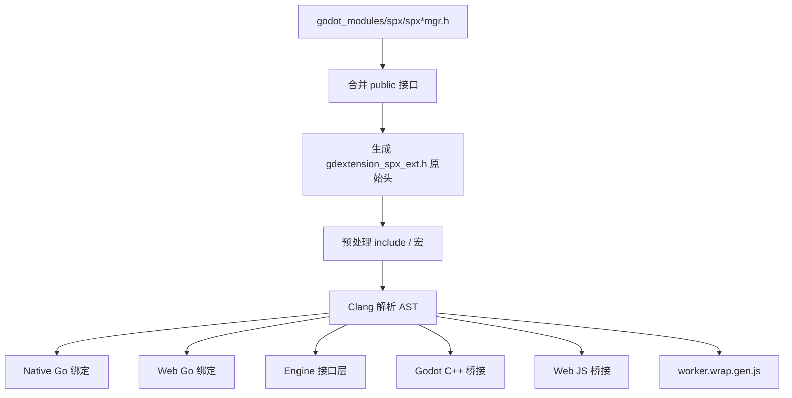

# SPX 绑定代码生成系统

本文档说明 SPX 当前的绑定代码生成链路，覆盖以下内容：

- Godot `spx` 模块头文件如何进入生成流程
- Go / Web / Native / Godot C++ 侧分别生成哪些文件
- 新增一个 manager 接口时应该改哪里
- 出现生成异常时优先看哪些位置

这里讨论的是 `internal/cmd/codegen` 这一套绑定生成器，不包含 `make generate-runtime` 触发的其他 `go generate` 任务。

## 1. 常用命令

最常用的入口有两个：

```bash
make generate-bindings
make generate
```

它们在 `Makefile` 中的定义如下：

- `make generate-bindings`
  - 执行 `cd ./internal/cmd/codegen && go run .`（`SPX_MODULE_SRC` 由顶层 Make 环境统一导出）
  - 只生成绑定相关代码
- `make generate`
  - 先执行 `generate-bindings`
  - 再执行 `generate-runtime`
  - 最后执行 `format`

如果没有显式传入 `SPX_MODULE_SRC`，生成器默认读写仓库下的 `./godot_modules/spx`。相对覆盖路径从 SPX 仓库根目录解析。

生成器自身是一个 nested Go module，并通过本地 `replace` 指回仓库根目录。因此其中的 `github.com/goplus/spx/v3 v3.0.0` 只是 `go run` 所需的最小合法 v3 module 版本，不是发布版本声明，SPX 发版时不要跟随提升。

推荐用法：

```bash
SPX_MODULE_SRC=/path/to/spx-module make generate-bindings
```

## 2. 整体链路

当前生成流程可以概括为：


```mermaid
graph TD
    A[godot_modules/spx/spx*mgr.h] --> B[合并 public 接口]
    B --> C[生成 gdextension_spx_ext.h 原始头]
    C --> D[预处理 include / 宏]
    D --> E[Clang 解析 AST]
    E --> F[Native Go 绑定]
    E --> G[Web Go 绑定]
    E --> H[Engine 接口层]
    E --> I[Godot C++ 桥接]
    E --> J[Web JS 桥接]
    E --> K[worker.wrap.gen.js]
```

`internal/cmd/codegen/main.go` 中的主流程分成三步：

1. `gdext.GenerateHeader(...)`
   - 从 Godot `spx` 模块头文件生成 `gdextension_spx_ext.h`
2. `gdextensionparser.GenerateGDExtensionInterfaceAST(...)`
   - 展开 include、预处理宏、生成 AST
3. `ffi.Generate(...)`、`webffi.Generate(...)`、`gdext.Generate(...)`
   - 基于 AST 生成 Go / JS / C++ 绑定

## 3. 关键目录与产物

### 3.1 输入源

真正的接口来源是 SPX 仓库自有模块中的 manager 头文件：

- `$(SPX_MODULE_SRC)/spx*mgr.h`

当前生成器只会扫描：

- 文件名匹配 `spx*mgr.h`
- `public:` 区域中的方法
- 带 `SPX_API` 或 `SPX_BIND` 标记的方法

不会进入生成流程的内容包括：

- `spx_base_mgr.h`
- `spx_object_mgr.h`
- 没有 `SPX_API` / `SPX_BIND` 的 helper 方法
- 内联函数定义
- 注释内容

### 3.2 中间文件

生成过程中常见的中间文件有两个：

- `internal/gdengine/binding/native/gdextension_spx_codegen_header.h`
  - AST 解析入口头文件
- `internal/gdengine/binding/native/_temp_output.h`
  - include 展开后的临时头文件

另外，默认还会在 `internal/cmd/codegen` 工作目录下写出：

- `_debug_parsed_ast.json`

这个 JSON 很适合调试“为什么某个方法没被识别”。

### 3.3 主要输出文件

按目标侧分类，当前会生成以下内容：

#### Native 绑定

- `internal/gdengine/binding/native/ffi_wrapper.gen.h`
- `internal/gdengine/binding/native/ffi_wrapper.gen.go`
- `internal/gdengine/binding/native/ffi.gen.go`

#### Web 绑定

- `internal/gdengine/binding/web/callbacks.gen.go`
- `internal/gdengine/binding/web/ffi.gen.go`

#### 引擎实现层

- `internal/gdengine/impl/manager_native.gen.go`
- `internal/gdengine/impl/manager_web.gen.go`

#### 引擎同步包装层

- `internal/enginewrap/sync.gen.go`
- `internal/enginewrap/sync_pure.gen.go`

#### 对外 Go API

- `pkg/spx/pkg/engine/interface.gen.go`
- `pkg/spx/pkg/engine/sprite.gen.go`
- `pkg/spx/pkg/engine/sprite_pure.gen.go`

#### Godot C++ / Web JS 注入文件

- `godot_modules/spx/gdextension_spx_ext.h`
- `godot_modules/spx/gdextension_spx_ext.cpp`
- `godot_modules/spx/web/godot_js_spx.cpp`
- `godot_modules/spx/web/js/engine/gdspx.js`

#### Web Worker 包装文件

- `cmd/spx/template/platform/webworker/worker.wrap.gen.js`

## 4. 代码结构

### 4.1 主入口

`internal/cmd/codegen/main.go`

负责串起整条生成链路：

- 计算默认 `SPX_MODULE_SRC`
- 触发 header 生成
- 触发 AST 解析
- 分别调度 `ffi`、`webffi`、`gdext`

### 4.2 Header 收集与 ABI 入口生成

`internal/cmd/codegen/generate/gdext/header.go`

这是整个系统最关键的入口之一，负责：

- 扫描 `spx*mgr.h`
- 提取 manager 名称
- 收集 `SPX_API` / `SPX_BIND` 方法
- 生成 `GDExtensionSpx...` 形式的 typedef
- 记录 native array / array transform 的桥接元数据

### 4.3 AST 解析

`internal/cmd/codegen/gdextensionparser/parse.go`

流程如下：

1. 找到项目根目录
2. 读取 `gdextension_spx_codegen_header.h`
3. 展开本地 include
4. 交给 `preprocessor` 做预处理
5. 调用 `clang.ParseCString(...)` 得到 AST
6. 按需写出 `_debug_parsed_ast.json`

### 4.4 模板生成

模板主要分布在以下目录：

- `internal/cmd/codegen/generate/ffi`
- `internal/cmd/codegen/generate/webffi`
- `internal/cmd/codegen/generate/gdext`

公共辅助逻辑在：

- `internal/cmd/codegen/generate/common/funcs.go`

`GenerateFile(...)` 会统一做几件事：

- 渲染模板
- 给 `.go` 文件补 license header
- 对生成的 Go 文件执行 `go fmt`
- 对生成的 Go 文件执行 `goimports -w`

所以日常维护时，应该改模板，不要直接改 `.gen.go`。

## 5. 接口导出规则

### 5.1 基本规则

一个方法要进入绑定生成，至少要满足：

1. 位于 `public:` 区域
2. 使用 `SPX_API` 或 `SPX_BIND`
3. 声明形式能被当前正则规则识别

典型例子：

```cpp
class SpxSpriteMgr {
public:
    SPX_API void batch_update_transforms(GdArray buffer);
    SPX_BIND GdBool destroy_sprite(GdObj obj);
};
```

### 5.2 直接原生数组桥接

即使没有高层 `GdArray` 版本，只要签名是这种模式：

```cpp
SPX_API void batch_update_transforms(const float *buffer_data, int len);
```

生成器会将它记录为统一的 `ArrayBridge`。`const` 指针对应 `Input`，可写指针对应 `Output`；两者都用 `ArrayBuffer` 描述元素类型、数据指针和长度参数。

只有输入或原地写入输出时，`ReturnArray` 为 `false`，缓冲区由调用者提供。例如：

```cpp
SPX_BINDING(output_count=3)
SPX_API void write_snapshot(float *out, int len);
```

这里 `Output.Count` 为 3。该声明提供固定输出长度信息，高层仍是 `WriteSnapshot(out []float32)`，保持原地写入。

Web 还会生成 `GdspxFuncs['arrayOutputs']['gdspx_input_write_snapshot']()` 读取入口，按声明的类型和数量分配原生数组并返回。新增固定输出方法只需添加声明，无需手写 JS 包装；底层内存分配共用 `ReadArrayOutput`。

目前内建支持的原始数组类型主要包括：

- `float *` / `real_t *`
- `int64_t *`
- `uint8_t *`

`GdObj *` 用于下面的数组转换，当前不映射为直接传入的 Go 切片。

数组的 ABI 编号、描述符标记、元素名称、固定元素字节数及 Go/C 类型映射统一定义在 `generate/common/arrays.go`。C 头文件的枚举、Web Go 的 `arrays.gen.go` 和 `gdspx.util.js` 中标记的数组 ABI 区域均由这份定义生成，包括 Go/JS 的元素大小查询函数，无需分别手写。扩展类型时仍须确认原生端与 Web 端支持对应的元素布局。

### 5.3 数组转换桥接

当底层接收输入、输出两个缓冲区，高层需要返回结果数组时，在声明中标注：

```cpp
SPX_BINDING(array_arg=objs, elements_per_input=2)
SPX_API void batch_retrieve_positions(const GdObj *ids, int count, float *out, int out_len);
```

它同样使用 `ArrayBridge`：`Input` 是对象数组，`Output` 是浮点数组，`ReturnArray` 为 `true`，`Output.ElementsPerInput` 为 2。桥接层按输入数量准备输出缓冲区，高层接口保持 `GdArray -> GdArray`。

三种调用形式共享 `ArrayBridges` 注册表、缓冲区解析和类型映射。生成器按缓冲区方向及结果分配规则生成调用，新增同类接口无需添加方法名特判。

### 5.4 统一绑定注解

`SPX_BINDING(...)` 在 C++ 中展开为空，只为生成器提供元数据。它可与方法声明同一行，或单独放在方法的上一行；方法仍须标记 `SPX_API` 或 `SPX_BIND`。

| 参数 | 含义 |
| --- | --- |
| `array_arg`、`elements_per_input` | 成对声明高层数组参数名及每个输入元素对应的输出数量 |
| `output_count` | 声明固定输出数量，保留原地写入接口 |
| `web=noop` | Web 绑定为空操作，要求方法返回 `void` |
| `web=reuse_result` | Web 按实例、方法复用结构化返回对象；调用者应立即消费或复制结果 |

例如：

```cpp
SPX_BINDING(web=noop)
SPX_API void free_str(GdString str);

SPX_BINDING(web=reuse_result)
SPX_API GdVec2 get_global_mouse_pos();

```

Web Go 缓存由 Go 函数自动接入：在 `internal/gdengine/binding/web/*_cache.go` 中定义 `Cached<Manager><Method>` 函数，参数与接口一致，并在末尾接收 `func() T` 回退闭包。例如 `CachedInputGetKey(key int64, fallback func() bool) bool` 对应 Input 的 `get_key`。函数访问共享的运行时缓存，无需创建缓存实例。

生成器扫描这些函数，自动生成参数转换、FFI 回退调用及缓存接入。缓存类别和布尔值适配留在 Go 实现中，C++ 头文件无需缓存注解。缺少对应接口或回退签名不合法时生成失败。

参数顺序不限，数量须为正的 int32。未知参数、重复参数、缺失配对参数以及与方法签名不兼容的组合会导致生成失败。固定输出长度和数组变换互斥，Web 策略不能覆盖已声明的数组桥接。

## 6. 新增一个接口时怎么改

推荐按下面顺序操作：

1. 在 `$(SPX_MODULE_SRC)/spx*_mgr.h` 中新增方法声明。
2. 确保它位于 `public:` 区域，并带上 `SPX_API` 或 `SPX_BIND`。
3. 如果需要数组桥接，使用可识别的指针 + 长度签名。
4. 如果需要返回数组、固定输出长度或 Web 绑定策略，添加相应的 `SPX_BINDING(...)` 参数。
5. 运行 `make generate-bindings`。
6. 检查生成结果是否覆盖到了预期文件。
7. 补相应测试，尤其是：
   - `internal/cmd/codegen/generate/gdext/header_test.go`
   - `internal/cmd/codegen/generate/webffi/generate_test.go`

## 7. 调试建议

### 7.1 方法完全没生成

优先检查：

- 方法是否在 `public:` 下
- 是否加了 `SPX_API` / `SPX_BIND`
- 是否写成了生成器当前支持的声明形式
- 是否被写成了 inline 定义

### 7.2 AST 里没有这个方法

优先看：

- `internal/gdengine/binding/native/_temp_output.h`
- `internal/cmd/codegen/_debug_parsed_ast.json`

如果这两个文件里都没有，问题通常出在 header 合并或预处理阶段。

### 7.3 SPX 模块侧文件没有更新

优先检查：

- `SPX_MODULE_SRC` 是否指向正确的 SPX 模块目录
- `$(SPX_MODULE_SRC)` 是否存在
- `$(SPX_MODULE_SRC)/web/js/engine` 是否可写

从代码逻辑看，如果 `SPX_MODULE_SRC` 目录不存在，`gdext.GenerateHeader(...)` 和 `gdext.Generate(...)` 会给出 warning 并跳过 Godot C++ 侧更新。

### 7.4 Web fast path 异常

优先看：

- `internal/cmd/codegen/generate/webffi/generate_test.go`
- `internal/cmd/codegen/generate/gdext/header_test.go`

这两组测试已经覆盖了：

- GdObj 扁平参数 ABI
- 固定 scratch 缓冲区读取
- native array bridge
- array transform bridge
- 输入缓存 override

## 8. 不要直接修改哪些文件

以下文件默认都应视为生成产物：

- `*.gen.go`
- `*.gen.h`
- `cmd/spx/template/platform/webworker/worker.wrap.gen.js`
- `godot_modules/spx/web/js/engine/gdspx.js`
- `godot_modules/spx/web/godot_js_spx.cpp`
- `godot_modules/spx/gdextension_spx_ext.h`
- `godot_modules/spx/gdextension_spx_ext.cpp`

需要改行为时，优先改这些位置：

- Godot manager 头文件
- `internal/cmd/codegen/generate/**` 下的模板
- `internal/cmd/codegen/generate/common/funcs.go`
- `internal/cmd/codegen/generate/gdext/header.go`

## 9. 小结

SPX 当前的绑定生成系统，本质上是：

- 先从 Godot `spx` 模块头文件提取稳定 ABI
- 再把 ABI 解析成 AST
- 最后从同一份 AST 同步生成 Native / Web / Engine / Godot C++ 多端桥接代码

维护这套系统时，最重要的经验有三条：

- 先改源头 header 或模板，不要手改生成产物
- 新增数组桥接时，声明指针 + 长度签名及必要的 `SPX_BINDING` 参数
- 出问题先看 `_temp_output.h` 和 `_debug_parsed_ast.json`
