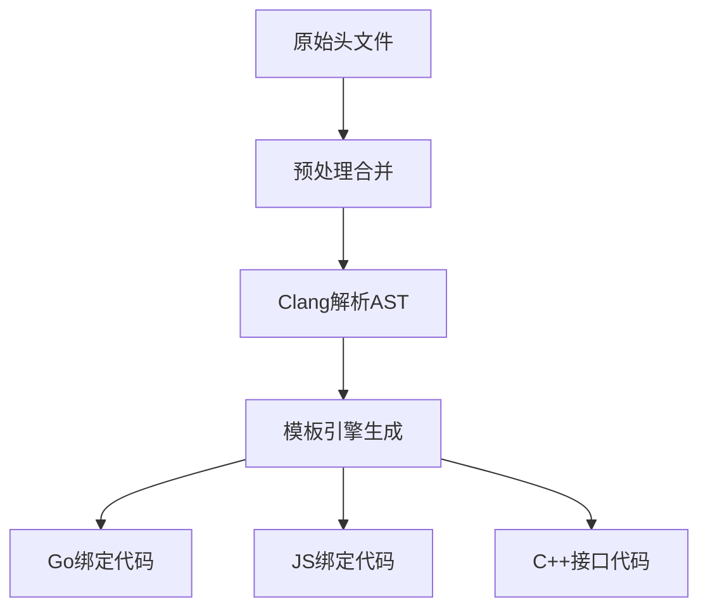

# Godot扩展代码生成系统架构文档

## 1. 整体流程



## 2. 核心组件

### 2.1 头文件处理 (header_generator.go)

**功能**：合并管理器头文件并生成接口声明

**关键函数**：
```go
func generateSpxExtHeader(dir, outputFile string, isRawFormat bool)
func mergeManagerHeader(dir string) string
func generateManagerHeader(input string, rawFormat bool) string
```

**处理流程**：
1. 扫描spx*mgr.h文件
2. 提取public方法
3. 生成typedef函数声明

### 2.2 AST生成 (parse.go)

**功能**：使用Clang解析C头文件生成AST

**关键函数**：
```go
func GenerateGDExtensionInterfaceAST(projectPath, astOutputFilename string)
func generateGDExtensionInterfaceAST(b, projectPath, astOutputFilename string)
```

**数据结构**：
```go
type CHeaderFileAST struct {
    Decls []Declaration
}
```

### 2.3 代码生成引擎 (generate.go)

**模板系统**：
```go
// Go绑定模板
text/template.New("ffi_wrapper.gen.h").Parse(...)

// JS绑定模板
text/template.New("gdspx.js").Parse(...)
```

## 3. 跨语言调用机制

### 3.1 类型映射

| C++类型   | Go类型   | JS类型     |
|-----------|----------|------------|
| GdVec2    | Vec2     | {x,y}对象  |
| GdString  | string   | string     |
| GdObj     | Object   | number     |
| GdBool    | bool     | boolean    |

### 3.2 内存管理

```javascript
// JS示例
function ToGdVec2(jsObj) {
    const ptr = _malloc(8);
    HEAPF32[ptr/4] = jsObj.x;
    HEAPF32[ptr/4+1] = jsObj.y;
    return ptr;
}
```

### 3.3 函数绑定

```go
// Go绑定示例
func (m *SpriteMgr) SetPosition(obj Object, pos Vec2) {
    C.GDExtensionSpriteMgrSetPosition(C.GdObj(obj), C.GdVec2{X: pos.X, Y: pos.Y})
}
```

## 4. 模板示例 (gdextension_spx_ext.h.tmpl)

```c
// 模板占位符
###MANAGER_FUNC_DEFINE

// 生成结果示例
typedef void (*GDExtensionSpriteMgrSetPosition)(GdObj obj, GdVec2 pos);
```

## 5. 关键代码示例

### 5.1 AST生成调试

```go
// parse.go
ast, err := clang.ParseCString(preprocText)
if err != nil {
    panic(err)
}
json.Marshal(ast) // 输出JSON格式AST
```

### 5.2 JS绑定生成

```go
// webffi/generate.go
function getJsFuncBody(function *clang.TypedefFunction) string {
    // 生成参数转换代码
    for i, arg := range function.Arguments {
        sb.WriteString("To"+arg.Type.Primative.Name+"(...)")
    }
}
```

## 6. 开发工作流

1. 修改 `spx_sprite_mgr.h` 添加新方法
2. 运行 `make gen` 生成绑定
3. 检查生成的 `gdextension_spx_ext.h` 和绑定代码
4. 在 Go/JS 中调用新接口

## 7. 调试步骤
