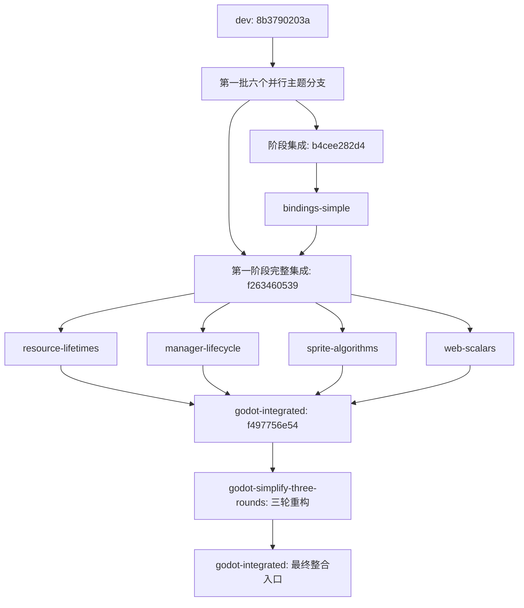

# Godot 集成分支依赖与三轮去冗余

后续对 14 个相关分支逐一完成的新一轮简化、提交和最终分支关系见[全分支去冗余记录](godot_modules_all_branches.md)。本文保留前三轮的历史记录。

最终交付入口为 `refactor/godot-integrated`。三轮开发分支 `refactor/godot-simplify-three-rounds` 从它的 `f497756e54` 创建，完整继承此前改动；三轮完成后以快进方式同步回整合分支，不需要逐个重新 cherry-pick。两个分支都保留并推送到 `origin`（`joeykchen/spx`）。

## 分支依赖

| 分支 | 三轮开始前提交 | 分叉基点及依赖 |
| --- | --- | --- |
| `refactor/godot-lifecycle-controls` | `812807e799` | `8b3790203a`，第一批并行主题分支 |
| `fix/godot-web-session-lifetime` | `3a2ccfbd90` | `8b3790203a`，第一批并行主题分支 |
| `refactor/godot-audio-ownership` | `812bcef7a8` | `8b3790203a`，第一批并行主题分支 |
| `refactor/godot-object-access` | `aeff00fd9e` | `8b3790203a`，第一批并行主题分支 |
| `refactor/godot-visual-resources` | `721f9da79e` | `8b3790203a`，第一批并行主题分支 |
| `refactor/godot-abi-boundaries` | `b60915093d` | `8b3790203a`，第一批并行主题分支 |
| `refactor/godot-bindings-simple` | `f5d2453691` | 集成快照 `b4cee282d4`；包含上述六条线当时已合入的改动，visual 的后续修正另行合入集成分支 |
| `refactor/godot-resource-lifetimes` | `3a678f93de` | 第一阶段完整集成 `f263460539` |
| `refactor/godot-manager-lifecycle` | `5ce1bb336f` | 第一阶段完整集成 `f263460539` |
| `refactor/godot-sprite-algorithms` | `310cecb823` | 第一阶段完整集成 `f263460539`，包含独立冲量修正 `d9fd022e02` |
| `perf/godot-web-scalars` | `5677b7cca7` | 第一阶段完整集成 `f263460539` |
| `refactor/godot-integrated` | `f497756e54` | 包含全部上述分支，以及集成修正、交付文档、测试侵入清理 |

第一批六个分支具有共同基点，Git 历史上互不依赖。第二批四个分支都依赖 `f263460539`，彼此没有分支依赖。`bindings-simple` 替代了早期 ABI 分支中的绑定注解方案；采用集成版本即可得到最终设计。主题分支保留过程历史，完整交付以集成分支为准。

## 三轮范围

1. **64 位输入按值传递**：`GdObj` / `GdInt` 由生成器统一识别。Go 保留低位、高位两个 `uint32` 参数，JS 精确组合为有符号 `BigInt`，C++ Web 入口接收值。删除相应输入池构造步骤；数组、输出和返回值所有权保持原协议。
2. **资源加载与字体状态去重**：合并直接位图加载的路径解析、读取、纹理创建和成功缓存；分别保留 checked 失败返回空、普通失败返回未缓存占位图的行为。字体准备直接使用发布结构，去掉重复字体引用和中间转换。
3. **删除 Wasm 导出镜像缓存**：工具层直接访问 `Module` 导出，移除重复函数引用、绑定函数和身份同步检查。数组借用期与内存增长校验继续保留。

范围仍为 Native 与普通 Web；录制和 Worker 的实现不纳入本轮。验证通过现有公开行为、生成器和独立 ABI 入口完成，不新增测试专用 friend 或生产钩子。

## 提交与验证

三轮各自独立提交，按顺序依赖前一轮：

| 轮次 | 提交 | 已完成结果 |
| --- | --- | --- |
| 1 | `66da2543af` | 输入按值传递；删除 `gdspx_new_int` / `gdspx_new_obj` 及对应构造、回收代码；包含生成器修改和真实 Wasm 基准扩展 |
| 2 | `d842fdd0df` | 统一位图加载；字体准备直接使用发布结构；生产代码净减 39 行 |
| 3 | `49a60be313` | 删除 34 个 Wasm 函数镜像和一份 Module 身份缓存；工具层净减 113 行；保留 arena 的原实例释放函数 |

- Native 完整编译、链接通过；`*SPX*,*Loop phase callbacks*` 共 72 个用例、637 个断言通过。
- 普通 Web 使用 Emscripten 3.1.62、`threads=no`，完整编译、链接及模板打包通过。
- codegen 全部 Go 测试、33 项 Node 测试、Go js/wasm binding 测试通过；再次生成绑定零差异。
- 独立 Web 字符串/数组 ABI 检查与 UBSan 通过。
- 真实 Wasm 基准验证了 0、超过 2^53 的整数、正负边界、完整 ID、多参数顺序、返回缓冲及内存增长。ID 混合调用吞吐在本机提高约 8%–14%；100 个精灵旋转/可见性更新的跨边界调用从 600 次降到 200 次，吞吐提高约 9%。BigInt 转换仍有成本，不能按调用数比例推断性能。
- 第三轮单独对比第一轮：无输出池的 ID 调用约在 1% 内波动，带 bool 返回缓冲的调用提高约 8%，没有测得明显回退。原始数据与复现方法见 [基准说明](../../../../godot_modules/spx/web/benchmarks/README.md)。未将 Node 微基准当作实际游戏 FPS 或完整浏览器验收。

后续已执行完整 `make generate`，并通过本机正式构建流程编译编辑器、Native runtime 与普通 Web runtime，实跑 `05-Animation` 的 `spx runnative` 和 `spx runweb`。详细环境、现象和限制见 [示例验证记录](godot_modules_animation_validation.md)。生成的 `export.types` 同步此前注释修改后的源码位置，没有 API 或签名变化。

Web 验证发现的历史舞台布局问题在独立分支 `fix/godot-web-stage-letterbox` 修复，不并入本轮重构整合分支。

早期两份未纳入 Git 的 [审查记录](godot_modules_review.md) 和 [重构方案](godot_modules_refactor_plan.md) 已一并收录，并标注为历史文档；原 `dev` 工作区保留原状。主题分支保留过程历史；`godot-integrated` 与三轮开发分支同步完整重构及后续验证记录。
